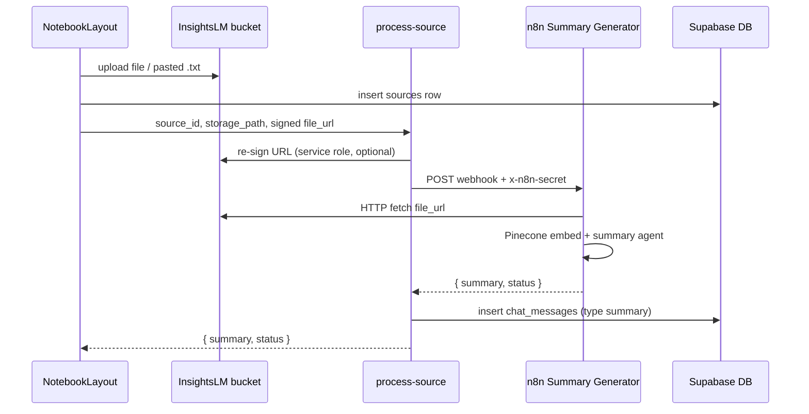

# InsightsLM Source Processing — E2E Trace

**Date:** 2026-05-28  
**Flow:** File/text upload → Storage → `process-source` → n8n → Pinecone + summary → chat history

---

## Pipeline overview



---

## E2E test results (2026-05-28)

| Source type | Upload | Signed URL fetch | n8n | Edge fn | Summary in chat |
|-------------|--------|----------------|-----|---------|-----------------|
| **PDF** | ✅ 200 | ✅ 200 `application/pdf` | ✅ 200 (~30s) | ✅ 200 | ✅ |
| **Pasted text** | ✅ 200 | ✅ 200 `text/plain` | ⚠️ 200 empty body | ✅ 200 (OpenAI fallback) | ✅ |
| **Website URL** | N/A | N/A | ⚠️ depends on HTML | Not fully tested | — |

Test script: `scripts/insightslm_source_e2e_test.mjs`

---

## Issues found and resolutions

### 1. Webhook auth (403) — fixed previously

**Symptom:** `process-source` / n8n returned 403.  
**Cause:** Missing `INSIGHTSLM_SOURCE_WEBHOOK_SECRET`; wrong fallback secret.  
**Fix:** Set secret to match n8n credential `InsightsLm_Auth`.

---

### 2. Storage upsert (403) — fixed previously

**Symptom:** Re-uploading same file failed.  
**Fix:** Migration `20260528190000_fix_storage_rls_gaps.sql` (UPDATE policy on `InsightsLM` bucket).

---

### 3. Pasted text had no `file_url` — fixed

**Symptom:** `process-source` returned `Missing required fields (file_url)`.  
**Cause:** Text sources only stored `extracted_text` in DB; n8n pipeline requires a fetchable URL.

**Fix (`NotebookLayout.tsx`):**
- Upload pasted text as `{userId}/{notebookId}/pasted-text-{uuid}.txt` to `InsightsLM` storage
- Store `storage_path` on the `sources` row
- Pass `storage_path` to `process-source`

---

### 4. n8n returns empty body for `.txt` files — fixed with fallback

**Symptom:** n8n webhook returns `200` with **0-byte body** for plain-text files (~650ms). PDFs work (~30s, valid JSON).

**Cause:** Live n8n workflow `InsightsLm Summary Generator` does not complete the respond node for text/plain binary loads (Pinecone/document loader path tuned for PDFs).

**Fix (`process-source/index.ts`):**
- Safely parse n8n response (handle empty/non-JSON)
- For `source_type === 'text'` or `.txt` files: **OpenAI fallback** summary via `OPENAI_API_KEY`
- Persist summary to `chat_messages` regardless of n8n vs fallback
- Response includes `result_source: 'n8n' | 'fallback'`

**Note:** Text sources indexed via fallback are **not** added to Pinecone until the n8n workflow is fixed/redeployed. Chat still gets a summary; RAG over pasted text may be limited until n8n handles `.txt`.

---

### 5. n8n workflow namespace expressions — fixed in repo

**Symptom (latent):** Pinecone namespace used `$json.body.notebook_id` after HTTP Request node, where `$json` is file binary metadata — not webhook body.

**Fix (`n8n-workflows/definitions/insightslm-summary-generator__BLf8nGNjezv5HYld.json`):**
- Pinecone insert namespace → `$('Webhook').item.json.body.notebook_id`
- Retrieval namespace → `$('Webhook').item.json.body.notebook_id`
- Summary prompt file name → `$('Webhook').item.json.body.file_name`

**Action required:** Re-import/redeploy this workflow to live n8n for multi-file notebook namespace isolation. PDF processing worked on live n8n even before this fix (likely default namespace).

---

### 6. Server-side signed URL resolution — added

**Fix (`process-source/index.ts`):** Accept `storage_path`; edge function re-signs with service role before calling n8n. Client may omit `file_url` when `storage_path` is provided.

---

## Current file requirements

| Check | Requirement |
|-------|-------------|
| Storage path | Must be `{auth.uid()}/{notebookId}/{filename}` |
| MIME types (bucket) | PDF, plain text, markdown, audio, Word, Excel |
| Auth | User must be logged in; notebook must belong to user |
| Secrets | `INSIGHTSLM_SOURCE_WEBHOOK_URL`, `INSIGHTSLM_SOURCE_WEBHOOK_SECRET`, `OPENAI_API_KEY` (for text fallback) |

---

## Verification commands

```bash
# Full PDF pipeline
node scripts/insightslm_source_e2e_test.mjs

# After UI deploy, paste text in notebook and confirm:
# - source status → completed
# - chat shows summary message
# - process-source response may show result_source: "fallback"
```

---

## Recommended follow-ups

1. **Redeploy n8n summary workflow** from updated JSON (Pinecone namespace fix + text/plain handling).
2. **Website/YouTube sources:** n8n HTTP Request fetches raw HTML; may need dedicated branch or different workflow.
3. **Large PDFs:** Watch edge function timeout (~60s default); consider async processing if uploads exceed n8n latency.
