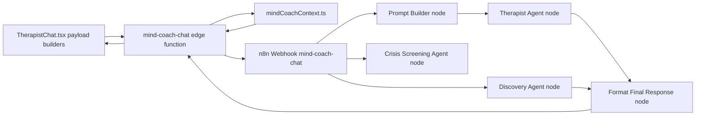

# Mind Coach Chat Webhook Field Trace

This document explains each element sent to the chat webhook (`mind-coach-chat`), where it comes from, how it is transformed, and where it is used.

Scope:
- Frontend payload creation in `components/MindCoach/Chat/TherapistChat.tsx`
- Edge function merge/normalization in `supabase/functions/mind-coach-chat/index.ts`
- Continuity pack generation in `supabase/functions/_shared/mindCoachContext.ts`
- n8n workflow usage in `n8n-workflows/definitions/mind-coach-therapist-chat-and-discovery-v6-robust__EBo9At6eCh0S7vkM.json`

---

## End-to-End Flow

---

## Payload Wrapper (`headers`, `params`, `query`, `body`, `webhookUrl`, `executionMode`)

These are visible in n8n execution logs, but not all are authored by our app code.

### `headers`
- Origin: HTTP transport layer (Supabase Edge Runtime + reverse proxies + n8n ingress).
- Examples: `host`, `user-agent`, `x-forwarded-for`, `x-real-ip`, `content-type`, `traceparent`.
- Usage:
  - `x-n8n-secret` is validated by n8n webhook security pattern.
  - Most other headers are infrastructure metadata and not read by Prompt Builder logic.

Sample header element mapping:
- `host`, `x-forwarded-host`, `x-forwarded-port`, `x-forwarded-proto`, `x-forwarded-server`: proxy/routing metadata.
- `user-agent`: runtime sender (`Deno` + Supabase Edge Runtime).
- `content-length`, `content-type`, `accept`, `accept-encoding`, `accept-language`: HTTP protocol/content negotiation.
- `traceparent`: distributed tracing context.
- `x-forwarded-for`, `x-real-ip`: client IP chain.
- `x-n8n-secret`: shared secret header from edge to n8n; used for webhook authorization.

### `params`, `query`
- Origin: webhook route extraction from n8n.
- Current value: `{}` in this payload shape.
- Usage: not used in current chat workflow logic.

### `body`
- Origin: JSON assembled in `supabase/functions/mind-coach-chat/index.ts` before POST to n8n.
- Usage: primary input consumed by Prompt Builder/Discovery/format nodes.

### `webhookUrl`, `executionMode`
- Origin: n8n execution metadata.
- Usage: observability only.

---

## Field Lineage: Chat Webhook `body`

Legend:
- **Origin** = where value is initially sourced.
- **Transform** = normalization/defaulting done in edge.
- **Usage** = where n8n nodes consume it.

## Identity / Session Fields

### `session_id`
- Origin:
  - Frontend payload in `TherapistChat.tsx` (`runInitialGreeting`, `handleSend`, retry path).
- Transform:
  - Required in edge (`400` if missing).
  - Passed through unchanged to n8n.
- Usage:
  - Not explicitly used by Prompt Builder text logic.
  - Available for workflow-level tracing.

### `profile_id`
- Origin:
  - Frontend payload (`profile?.id`).
- Transform:
  - Required in edge (`400` if missing).
  - Passed through unchanged.
- Usage:
  - Not used directly in Prompt Builder prompt text.

### `message_text`
- Origin:
  - Greeting: synthetic system text from frontend.
  - Send: user input string.
  - Retry: last user message text.
- Transform:
  - Required unless `is_system_greeting === true`.
- Usage:
  - Crisis node prompt.
  - Prompt Builder (`latestUserMessage`) for intent/difficulty detection and therapist user turn.

### `user_message_id`
- Origin:
  - Edge-generated (`crypto.randomUUID()`) only if edge handles message persistence.
  - `null` when `client_managed_persistence === true`.
- Transform:
  - Pass-through to n8n.
- Usage:
  - Not used by Prompt Builder today; useful for correlation/logging.

### `session_state`
- Origin:
  - Frontend active session state.
- Transform:
  - Defaults to `'intake'` when forwarding if falsy.
- Usage:
  - Format Final Response sets `session_state` output as `data.session_state || "active"`.

### `message_count`
- Origin:
  - Frontend computed count in chat send flow.
- Transform:
  - Edge computes `newCount`:
    - If client-managed: use client number if valid, else DB value.
    - Else: DB count + user increment.
- Usage:
  - Prompt Builder turn-stage logic and discovery cadence rules.

### `is_system_greeting`
- Origin:
  - Frontend sets `true` only for initial greeting request.
- Transform:
  - Affects edge required-field guard and DB persistence behavior.
- Usage:
  - Prompt Builder greeting branch behavior.

---

## User / Profile Fields

### `profile`
- Origin:
  - Frontend object from store: `name`, `age`, `gender`, `concerns`, `therapist_persona`.
- Transform:
  - If not client-managed, edge may replace with DB profile (`mind_coach_profiles`).
  - Else uses client object or `null`.
- Usage:
  - Prompt Builder `[CLIENT PROFILE]`.
  - Greeting personalization by name.

### `coach_prompt`
- Origin:
  - Frontend loads persona prompt from `mind_coach_personas.base_prompt`.
- Transform:
  - Edge fallback default if absent.
  - If not client-managed, edge may override from DB persona lookup.
- Usage:
  - First block in Prompt Builder `systemPrompt`.

---

## Journey / Phase Fields

### `journey_context`
- Origin:
  - Server-authored in edge from `mind_coach_journeys` using session's `journey_id`.
  - Frontend journey context is now fallback only.
- Transform:
  - Edge normalizes `phases` into canonical session-object shape (`session_number`, `title`, `objective`, `success_signal`).
- Usage:
  - Available to Prompt Builder and downstream nodes as journey scaffold metadata.

### `pathway`
- Origin:
  - Frontend active session/journey.
- Transform:
  - Pass-through.
- Usage:
  - Format Final Response defaults final `pathway`.
  - Discovery may emit `suggested_pathway` separately.

### `phase_prompt`
- Origin:
  - Frontend loads from `mind_coach_pathway_phases.dynamic_prompt`.
- Transform:
  - Edge fallback default if missing.
  - If not client-managed, may be replaced from DB lookup.
  - Edge appends `[SESSION GOAL CONTEXT]` block when `session_goal_context` exists.
- Usage:
  - Included directly in Prompt Builder `systemPrompt`.

---

## Transcript / Continuity Fields

### `messages`
- Origin:
  - Frontend sends current store messages.
- Transform:
  - Edge now prefers canonical `last_20_conversations` as bounded transcript for this field too.
  - Falls back to legacy message sources only if continuity transcript is unavailable.
- Usage:
  - Legacy transcript channel for compatibility.
  - Crisis node fallback transcript channel.
  - Prompt Builder transcript, anti-repetition, fallback if continuity transcript missing.
  - Discovery node transcript formatting.

### `last_20_conversations`
- Origin:
  - Server-authoritative continuity pack from `buildConversationWindow`.
  - Not authored by frontend.
- Transform:
  - If continuity builder fails: `[]`.
- Usage:
  - Prompt Builder primary cross-session transcript source.
  - Crisis node bounded transcript source.
  - Falls back to `messages.slice(-N)` if empty.

### `transcript_limit`
- Origin:
  - Edge runtime env var `MC_CHAT_TRANSCRIPT_LIMIT` (default `20`, clamped `8..30`).
- Transform:
  - Edge computes once and forwards to n8n.
- Usage:
  - Prompt window sizing and replay QA instrumentation.

### `continuity_phase_context`
- Origin:
  - Server-authoritative continuity pack from `buildPhaseContext`.
- Transform:
  - If no journey context available or builder fails: `null`.
- Usage:
  - Prompt Builder phase-goal steering (`phase_goal`, counters, stage, sessions remaining).

### `session_stage`
- Origin:
  - Continuity pack (`phase_context.session_stage`), top-level convenience key.
- Transform:
  - Defaults to `'early'` if continuity builder fails.
- Usage:
  - Prompt Builder phase steering fallback.
  - Included in quality signal guidance.

### `session_goal_context`
- Origin:
  - Server-authoritative continuity pack (`buildPhaseContext` -> `resolveSessionGoalContext`).
- Transform:
  - Emits per-session objective fields for current phase progression.
- Usage:
  - Edge uses it to augment `phase_prompt`.
  - Available to n8n for explicit session-objective adherence.

---

## Tasks / Case Notes / Assessments / Memories

### `memories`
- Origin:
  - Frontend store list (`text/type`) or DB list in non-client-managed mode.
- Transform:
  - Edge maps to normalized `{ text, type }`.
- Usage:
  - Prompt Builder consolidated memory context.

### `recent_tasks_assigned`
- Origin:
  - Frontend active tasks list (or DB active tasks in non-client-managed mode).
- Transform:
  - Passed through.
- Usage:
  - Legacy compatibility field only (deprecated as primary source).

### `active_tasks_context`
- Origin:
  - Server-authoritative continuity pack (`buildTaskContext`).
- Transform:
  - Defaults to `[]` on continuity failure.
- Usage:
  - Canonical task-followup source.

### `recent_case_notes`
- Origin:
  - Frontend key-insight strings (or DB completed session notes in non-client-managed mode).
- Transform:
  - Edge maps with `(s.case_notes || s)` and filters falsey values.
- Usage:
  - Legacy compatibility field only (deprecated as primary source).

### `recent_case_notes_context`
- Origin:
  - Server-authoritative continuity pack (`buildCaseNotesContext`).
- Transform:
  - Defaults to `[]`.
- Usage:
  - Prompt Builder formats recent case-note snippets and phase-progress context.

### `assessments`
- Origin:
  - Frontend optional array (usually empty) or DB fetch in non-client-managed mode.
- Transform:
  - Defaults to `[]`.
- Usage:
  - Not directly used by current Prompt Builder logic.

---

## Nested Object / Array Elements

These are child elements inside top-level fields in your sample payload.

### `profile.*`
- `profile.name`, `profile.age`, `profile.gender`, `profile.concerns`
  - Used in Prompt Builder profile context and greeting personalization.
- `profile.therapist_persona`
  - Used upstream when resolving `coach_prompt` in frontend/edge, not directly read by Prompt Builder text logic.

### `journey_context.*`
- `journey_context.id`, `title`, `current_phase`, `current_phase_index`, `phases`, `sessions_completed`
  - Passed through from frontend.
  - Not directly consumed by current Prompt Builder rules.
  - `current_phase` can influence edge phase prompt lookup in non-client-managed mode.

### `messages[]` children
- Used:
  - `messages[].role`, `messages[].content` (transcript + anti-repetition + discovery transcript).
- Generally not used directly in prompt logic:
  - `messages[].id`, `session_id`, `guardrail_status`, `created_at`, `dynamic_content`.

### `recent_case_notes_context[]` children
- `case_notes`, `ended_at`, `summary_data` are produced by continuity builder.
- Prompt Builder derives compact context primarily from `case_notes.presenting_concern`, `dynamic_theme`, `phase_progress`.

### `continuity_phase_context.*`
- Used in phase-goal steering:
  - `current_phase_index`, `total_phases`, `current_phase`, `next_phase`
  - `completed_in_current_phase`, `target_sessions_in_current_phase`
  - `session_stage`, `phase_goal`, `sessions_remaining_in_phase`

---

## Runtime Control Field

### `client_managed_persistence`
- Origin:
  - Frontend always sends `true` in current chat UI flow.
- Transform:
  - Used only in edge to switch behavior.
- Usage:
  - Not sent onward to n8n webhook body.

---

## n8n Response Fields Back to Edge/Frontend

Key response fields extracted by edge from n8n result:
- `reply`
- `session_state`
- `is_session_close`
- `dynamic_theme`
- `pathway`
- `pathway_confidence`
- `suggested_pathway`
- `guardrail_status`
- `crisis_detected`
- `dynamic_content`
- `quality_meta`

`quality_meta` is passed through when present as an object and returned to frontend in edge response payload.

---

## Known Gaps and Caveats

## Duplicate Representations
- Tasks appear in both:
  - `recent_tasks_assigned` (client/legacy stream)
  - `active_tasks_context` (server continuity stream, preferred)
- Case notes appear in both:
  - `recent_case_notes` (client/legacy stream)
  - `recent_case_notes_context` (server continuity stream, preferred)
- Transcript appears in both:
  - `messages`
  - `last_20_conversations` (preferred by Prompt Builder)

## Canonical Contract (current)
- Transcript: `last_20_conversations` (+ `transcript_limit`)
- Tasks: `active_tasks_context`
- Case notes: `recent_case_notes_context`
- Phase/stage: `continuity_phase_context`
- Session objective: `session_goal_context`
- Legacy compatibility only: `messages`, `recent_tasks_assigned`, `recent_case_notes`

## Fields Passed But Not Heavily Used in Current Prompt Logic
- `journey_context` (available but not directly consumed in Prompt Builder rules)
- `recent_case_notes` (Prompt Builder uses `recent_case_notes_context` instead)
- `assessments` (currently not consumed in prompt generation)
- `profile_id`, `session_id` (mostly traceability)

## Crisis Node Windowing
- Crisis node now reads `body.message_text` and bounded transcript from:
  - `body.last_20_conversations` (preferred), then legacy fallback arrays.
- This removes unbounded transcript injection from crisis prompt input.

## Continuity Builder Failure Behavior
- If `buildContinuityPack` throws, edge logs non-fatal error and still calls n8n with:
  - `last_20_conversations: []`
  - `active_tasks_context: []`
  - `recent_case_notes_context: []`
  - `continuity_phase_context: null`
  - `session_stage: "early"`
  - `session_goal_context: null`

---

## Windowing Experiment Snapshot (Execution 687 Replay Payload)

Live replays were executed with the execution-687 webhook payload while forcing transcript windows:

- `window=20`: `status=200`, `elapsed≈5882ms`, `context_used=true`, `phase_goal_touched=true`
- `window=16`: `status=200`, `elapsed≈4605ms`, `context_used=true`, `phase_goal_touched=true`
- `window=12`: `status=200`, `elapsed≈4452ms`, `context_used=true`, `phase_goal_touched=true`

Observed recommendation:
- Keep configurable default at `20` for now.
- Prefer `12-16` where latency pressure is high and continuity quality remains stable.

---

## Source Mapping by Layer

## Frontend payload construction
- `components/MindCoach/Chat/TherapistChat.tsx`
  - `runInitialGreeting`
  - `handleSend`
  - retry (`n8n_only`) branch

## Edge merge and n8n forwarding
- `supabase/functions/mind-coach-chat/index.ts`
  - request validation
  - client-managed vs server-managed context selection
  - continuity pack enrichment
  - n8n response normalization

## Continuity context builder
- `supabase/functions/_shared/mindCoachContext.ts`
  - `buildConversationWindow`
  - `buildTaskContext`
  - `buildCaseNotesContext`
  - `buildPhaseContext`
  - `buildContinuityPack`

## Workflow consumption
- `n8n-workflows/definitions/mind-coach-therapist-chat-and-discovery-v6-robust__EBo9At6eCh0S7vkM.json`
  - `Prompt Builder`
  - `Crisis Screening Agent`
  - `Discovery Agent`
  - `Format Final Response`

---

## Maintenance Notes

When webhook contract changes:
1. Update frontend payload builders in `TherapistChat.tsx`.
2. Update edge forwarding contract in `mind-coach-chat/index.ts`.
3. Update continuity keys in `mindCoachContext.ts` if semantics change.
4. Update n8n Prompt Builder/Format/Crisis node references.
5. Re-check this document against a fresh production payload sample.
