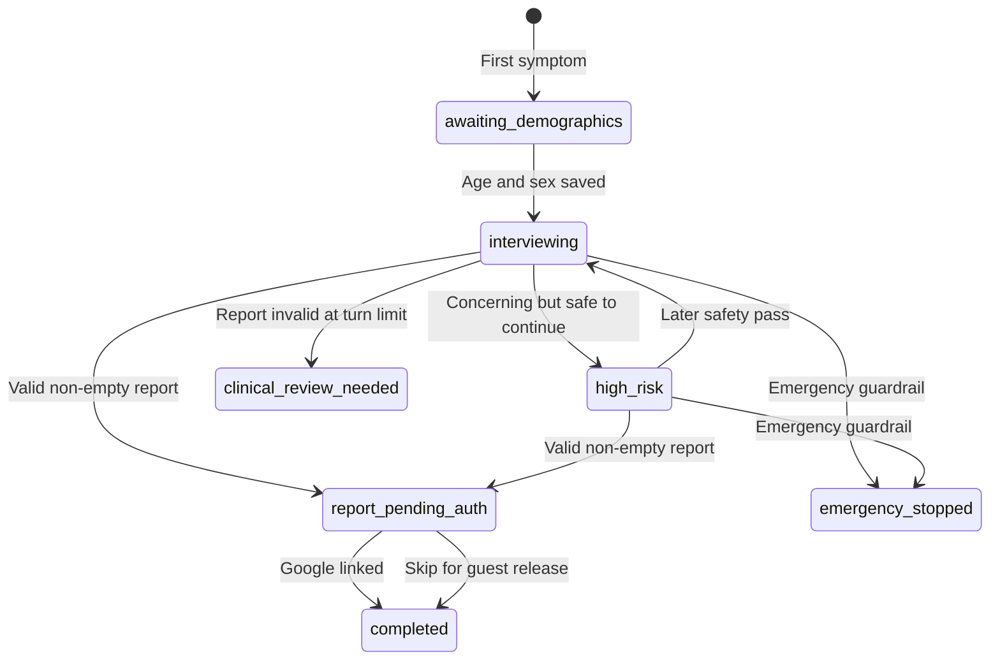

# LibertyMD Care Architecture

## Product Contract

LibertyMD starts with an anonymous Supabase Auth identity. The visitor is not asked to register before describing symptoms, but every clinical row still has a stable `auth.users.id` owner. Google is linked to that same identity only when the report is ready, so consultation ownership never needs to be migrated.

## Consultation State Machine

## Persistence

| Table | Purpose | Important fields |
| --- | --- | --- |
| `libertymd_profiles` | One profile per auth identity | unique `user_id`, age, sex, Google name/email/avatar, anonymous flag |
| `libertymd_consultations` | Durable state machine and request lease | status, version, active request, explicit slots, missing slots, intermediate differentials, safety state, report gate |
| `libertymd_messages` | Ordered, idempotent transcript | role, type, client message ID, options, target slot, slot updates, workflow metadata |
| `libertymd_safety_events` | Auditable safety decisions | `high_risk_continue`, emergency status, setting, red flags, source |
| `libertymd_reports` | Gated clinical output | report JSON, confidence, withheld/saved/guest access, retention |

The Edge Function is the only clinical writer. Authenticated clients have read-only RLS access to their own records, and withheld reports cannot be read directly through the Supabase API.

Each patient submission carries a stable client-generated UUID. A database function atomically claims a short lease for the consultation, rejects competing turns, recognizes completed retries, and permits recovery when the patient turn exists but its assistant response was interrupted. The client retries once with the same UUID, so a network retry cannot create a duplicate patient message.

## Workflow Contract

1. **Guardrail** receives the latest message, patient, slots, and transcript. It returns `pass`, `high_risk_continue`, or `force_end` plus risk, care setting, message, and red flags.
2. **Interview** receives explicit `filled_slots`, `missing_slots`, `target_slot`, patient, turn count, and transcript. It returns one question, four options, validated `slot_updates`, the next missing slots, and `ready_for_report`.
3. **Diagnosis** receives patient, slots, transcript, and stored intermediate diagnoses. A report is valid only when it has a non-empty differential, confidence of at least 60, and a clinical evidence score of at least 65.

At and after turn six, diagnosis runs every second turn and whenever the interview says the report is ready. Turn 15 forces a final attempt, but never forces completion: an empty, low-confidence, or low-evidence differential transitions to `clinical_review_needed`. Repeated non-clinical responses also stop in this state instead of producing a speculative report.

## Clinical Quality Gates

- Query-critical clinical state is stored explicitly in `filled_slots`, `missing_slots`, `target_slot`, and `clinical_evidence_score`.
- Placeholder values such as "unknown", "uncertain", and contradictory answers do not count as evidence.
- Off-topic responses cannot update clinical slots. Three consecutive or five total non-clinical responses trigger a safe review state.
- A deterministic emergency screen runs before n8n, and the n8n guardrail runs before every interview turn.
- High-confidence output can complete at 80 or above. Workflow-ready output can complete at 60 or above only when evidence is sufficient. At the turn limit, confidence must be at least 65.
- `high_risk_continue`, `force_end`, red flags, care setting, source, and raw guardrail output are persisted as separate safety events.

## Report Gate

- A generated report is stored as `withheld`; the response contains no report body.
- `linkIdentity({ provider: 'google' })` upgrades the anonymous auth user in place.
- After OAuth, `sync_identity` records Google name, email, avatar, and provider and releases the report as `saved`.
- Skip releases only the current report as `guest_released` and sets a seven-day retention deadline.
- Linked users have no consultation-retention deadline and can load history from the menu.

## Scale And Privacy

- Indexes cover owner history, status queues, message order, safety audit, and retention cleanup.
- JSONB is limited to evolving clinical structures; query-critical state remains in typed columns.
- n8n performs no database writes. It is a stateless inference layer behind the Edge Function.
- LibertyMD workflows disable successful/error/manual execution payload retention. The n8n host should also enable execution pruning as a defense in depth control.
- `cleanup_expired_libertymd_data()` should run daily using Supabase Cron or an external scheduler.
- Production anonymous sign-in should be protected by CAPTCHA/Turnstile and platform rate limits.
