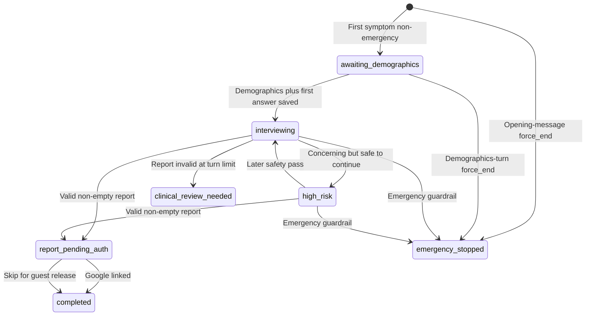

# LibertyMD Care Architecture

## Product Contract

LibertyMD starts with an anonymous Supabase Auth identity. The visitor is not asked to register before describing symptoms, but every clinical row still has a stable `auth.users.id` owner. Google is offered only when a report is ready. The normal path links Google to the same identity; if that Google identity already has a LibertyMD account, a short-lived, one-time transfer moves the anonymous consultation into the existing account.

**Anonymous = single self patient (P1-04):** An anonymous owner may have at most one `libertymd_patients` row, and it must be `relationship='self'` (via `getOrCreateSelfPatient` / `ensureSelfPatient`). Multi-profile (`dependent` / `other`) requires a linked identity; the proxy `create_patient` action rejects anonymous creates with HTTP 403 + `code: 'sign_in_required'` (application-enforced). P1-03 profile-aware demographics skip / picker and P4-04 profile CRUD consume this rule.

**Adults-only profiles (P1-05 launch constraint):** Patient age writes and under-floor rejects use `LIBERTYMD_MIN_PATIENT_AGE` (`profiles.ts`, currently **18**). Interview, diagnosis, and guardrail thresholds are adult-written — allowing a child profile would silently ship paediatric triage on adult red-flag rules. Under-floor rejects return `code: 'adults_only'` plus care-pointer copy (not ER/911). Lifting the floor later = change that one constant **plus** clinical-content review (prompts, guardrail thresholds, scenario corpus); P4-04 profile edit must reuse the same constant. Schema honesty: `libertymd_profiles.age` CHECK is already 18–120, but `libertymd_patients.age` CHECK still allows 0–17 — application enforcement + audit (`scripts/sql/libertymd-adults-only-audit.sql`) are load-bearing until a later migration.

**Profile management CRUD (P4-04):** Linked users manage active owned patients from AccountDrawer via proxy actions `list_owned_patients` / `create_patient` / `update_patient` / `delete_patient` (soft `is_active = false`). Cap: `LIBERTYMD_MAX_ACTIVE_PATIENTS = 5` (includes `self`) enforced on create → `code: 'profile_cap_reached'` + zero insert. Self is undeletable (`code: 'self_undeletable'`). Self edit dual-writes `libertymd_patients` + `libertymd_profiles` age/sex only; self `display_label` is not editable this ticket. Non-self edit: label (≤80) + age + sex (`female|male`); self sex uses demographics allow-list. Relationship immutable. **Never** rewrite past consultation `patient_snapshot` from profile edit — new consults may snapshot post-edit demographics. Soft-delete allowed even with open/past consults; inactive never offered for new binds; no reactivate. Management list returns age/sex for JWT owner only; bootstrap/intake `patients[]` stays non-PHI completeness flags (`toPatientListItem`). Anonymous multi-profile CRUD fenced (`sign_in_required`). No new PRODUCT_EVENT / Mixpanel lifecycle names. **Merge Path 2 residual:** P4-05 Path 2 can insert `other` without this cap — owners may exceed 5 after merge; do not reopen merge RPC to close that here.

### Deliberate visual boundary (P4-09)

DECISIONS 2026-07-30 · Product structure: LibertyMD and Dr. Jivi / AI Care are **two products** — **not** one shared shell. Visual posture:

- Route trees stay separate (`/liberty-md*` vs `/ai-care*`). Portfolio App path-scopes shell isolation: skip Grain on `/liberty-md*`; no Saksham cream/ink/gold as LibertyMD page language; LibertyMD Suspense fallback uses the LibertyMD surface wash.
- LibertyMD identity chrome (logo/wordmark + token wash) is Eng Done for the boundary — there is **no** LibertyMD→portfolio leave CTA and **no** LibertyMD→AI Care chrome. Soft-leave / draft / recoverable `consultationId` keep consult state inside LibertyMD (Chat → landing); no silent `abandon_consultation`; no native dialogs.
- Token SoT: `design-system/design-tokens.json` (`libertymd`) ↔ `index.css` `--libertymd-*` ↔ Tailwind `libertymd.*`. Client PDF helper (`libertymd-report-pdf.ts`) currently duplicates SoT literals as strings — follow-up hygiene; out of P4-09 Eng Done.
- Fences: FooterRibbon frozen; P4-06 Photo non-regression; lab (P4-07) and privacy page (P4-08 SKIPPED) out.

## Consultation State Machine

```mermaid
stateDiagram-v2
    [*] --> awaiting_demographics: First symptom non-emergency
    awaiting_demographics --> interviewing: Demographics plus first answer saved
    interviewing --> high_risk: Concerning but safe to continue
    high_risk --> interviewing: Later safety pass
    interviewing --> report_pending_auth: Valid non-empty report
    high_risk --> report_pending_auth: Valid non-empty report
    report_pending_auth --> completed: Google linked
    report_pending_auth --> completed: Skip for guest release
    [*] --> emergency_stopped: Opening-message force_end
    awaiting_demographics --> emergency_stopped: Demographics-turn force_end
    interviewing --> emergency_stopped: Emergency guardrail
    high_risk --> emergency_stopped: Emergency guardrail
    interviewing --> clinical_review_needed: Report invalid at turn limit
```

P1-01: non-emergency `start_consultation` returns the first interview question and persists `target_slot` while remaining in `awaiting_demographics`. The unified entry UI collects that answer with age/sex/consent before advance.

**P1-03 · Profile-aware entry branches:**
- **Gate** — first-timer / partial age|sex / non-current `consent_version` → `awaiting_demographics` (prefill when age/sex known but consent must be collected).
- **Skip** — exactly one **active** owned patient that is skip-eligible (age 18–120 + sex enum) **and** `libertymd_profiles.consent_version === CONSENT_VERSION` → seed `filled_slots.age` / `sex_at_birth`, append three `libertymd_consent_events` with `source: 'skip_reaffirm'`, emit `consent_recorded` (`method: 'skip_reaffirm'`), advance to `interviewing` / `high_risk`, return first question. Pure skip does **not** emit `demographics_saved`.
- **Picker-first** — any `activeOwnedCount > 1` requires explicit owned `patient_id` on start (never last-used / sole-complete auto-bind). Bootstrap exposes `patients[]` (id, relationship, display_label, completeness flags). Missing/foreign id → `code: 'patient_selection_required'` + non-PHI list echo. Explicit pick / someone-else-create emits allow-listed `profile_selected` (`relationship`, `selection_source` only).

**Expected interview length (P1-02 / P1-06):** hedged expected turns and minutes live in `components/LibertyMD/libertymd-interview-expectations.ts` (`EXPECTED_INTERVIEW_TURNS`, `EXPECTED_INTERVIEW_MINUTES`). Landing and unified-entry time promise derive from that module; P1-06 progress must **import** it and must not redefine `= 8`. Revisit the seeds when LibertyMD median turn-count / duration data exists. Ceiling (`MAX_INTERVIEW_TURNS` / proxy `MAX_TURNS`) is separate from expected length.

**Mid-interview progress (P1-06):** UI progress is slot-derived (`missing_slots` vs core-slot denominator 6) with a session high-water that never regresses; patient-facing copy stays qualitative plus a hedged “Up to {MAX_INTERVIEW_TURNS} questions” ceiling. Progress chrome must not restate expected-8 or equate 6=8=15. Shown only while client `phase === 'intake'`; hidden on emergency/terminal phases.

**Staged waiting (P1-07):** Chat uses whole-turn wait modes — ordinary turns show typing/thinking chrome; turns predicted diagnosis-eligible (same boolean as proxy `shouldRunDiagnosis`, from last-known `turn_count` + `evidence_score`) show distinct reviewing copy for the entire busy period. Prediction is best-effort (gate runs after slot merge server-side). Assistant interview / non-emergency clinical_review text reveals progressively client-side (not n8n streaming); emergency + reduced-motion mount full text immediately. Client Mixpanel `LibertyMd turn_completed` + `latency_bucket` measures TTFT (send → first assistant paint) with `latency_bucket_source: 'client_ttft'`. Server Mixpanel fan-out of Postgres `turn_completed` uses the same display name with `emit_origin: 'server'` and must not claim TTFT — see collision table under Product events.

## Persistence

| Table | Purpose | Important fields |
| --- | --- | --- |
| `libertymd_profiles` | One profile per auth identity | unique `user_id`, age, sex, Google name/email/avatar, anonymous flag |
| `libertymd_patients` | Patient identity separated from the account | owner, relationship, age, sex at birth, display label, active flag |
| `libertymd_consultations` | Durable state machine and request lease | patient, immutable patient snapshot, status, version, active request, explicit slots, missing slots, intermediate differentials, safety state, report gate |
| `libertymd_messages` | Ordered, idempotent transcript | role, type, client message ID, options, target slot, slot updates, workflow metadata |
| `libertymd_safety_events` | Auditable safety decisions | `high_risk_continue`, emergency status, setting, red flags, source |
| `libertymd_reports` | Gated clinical output | report JSON, confidence, withheld/saved/guest access, retention |
| `libertymd_diagnostic_runs` | Append-only diagnosis attempts and reasoning | input snapshot, clinical summary/reasoning, differential, confidence, evidence, validation reason, model/workflow metadata, `is_speculative` (P1-08; origin flag — may still be report source on cache serve) |
| `libertymd_identity_events` | Identity-link audit trail | link start/completion/cancel/conflict and account transfer events |
| `libertymd_account_merges` | Existing-Google-account recovery | hashed one-time token, source/target account, expiry, completion status |
| `libertymd_consent_events` | Append-only consent ledger | consent type/version, decision, patient, consultation, source |
| `libertymd_product_events` | Non-clinical funnel telemetry (Postgres SoT) | closed 18-name CHECK + `addProductEvent` / `emitEvent` helper; operational metadata only — no PHI; Mixpanel fan-out live via same helper (P1-16) |
| `libertymd_landing_sessions` | Session-keyed campaign attribution (P1-19) | `anon_session_key` + opaque `id`; allow-listed `utm_*` / `keyword_id` / `matched_topic_slug` / locale / device / path; `retention_expires_at` cleaned by P1-23 (expired **unreferenced** only); **never** raw `q=` / free-text search; **no** `user_id` |
| `libertymd_turn_facts` (view) | PHI-safe turn-grain ops fact join (P1-20 / P1-21) | `turn_index` spine; `patient_id` + nullable `landing_session_id`; awaiting/next `target_slot`; safety categoricals; diagnosis scalars + `is_speculative` + generated `top_dx_confidence`; generated `filled_slot_count`; **no** transcripts / slot values / JSONB clinical blobs; **no** `triage_tier` (join `libertymd_reports` directly) |

### Turn facts view (P1-20)

- **Purpose:** one ops SQL surface to answer where the interview dies — survival by turn, stalls by awaiting `target_slot`, guardrail verdicts by turn, confidence/evidence by turn — joinable to patient and landing session without exposing free-text clinical content.
- **Grain (Q1B):** `generate_series(1, GREATEST(consultations.turn_count, 1))` as `turn_index` per consult. `LEFT JOIN` `libertymd_safety_events` and `libertymd_diagnostic_runs` on `(consultation_id, turn_count = turn_index)`. Messages join is for **`target_slot` only** (assistant stamp) so the four-table AC1 claim holds without selecting `content` / `slot_updates`.
- **Dedup (Q2A):** `DISTINCT ON (consultation_id, turn_count)` — safety `ORDER BY created_at DESC` (latest wins; demographics duplicate at turn 1); diagnosis `ORDER BY is_speculative ASC, created_at DESC` (prefer non-speculative; keep speculative if only). Expose `is_speculative`.
- **`target_slot` / stall (Q5A):** view column = **awaiting/next ask** (ranked assistant messages with non-null `target_slot` by `sequence`). On the consult’s max turn, coalesce to `consultations.target_slot` when status ∈ `abandoned` / `interviewing` / `high_risk` / `awaiting_demographics` / `clinical_review_needed` / `report_pending_auth`. `completed` / `emergency_stopped` are non-stall. AC5(b): `DISTINCT ON (consultation_id) … ORDER BY turn_index DESC` + stallable status filter — see `scripts/sql/libertymd-turn-facts-analyses.sql`.
- **Allow-list (Q7A / P1-21):** `consultation_id`, `user_id`, `patient_id`, `landing_session_id`, consult `status`, `turn_index`, `target_slot`, `safety_status` / `risk_level` / `force_end` / `safety_source` / `crisis_type` / `care_setting`, `run_status` / `confidence_score` / `evidence_score` / `top_dx_confidence` / `is_speculative`, `clinical_evidence_score`, `filled_slot_count`, analysis timestamps. **Ban:** `content`, `slot_updates`, `filled_slots`, `missing_slots`, `chief_complaint`, safety `message` / `red_flags` / `raw_result`, diagnosis JSONB blobs, `options`, `metadata`, `validation_reason`, `patient_snapshot`, `safety_state`, `intermediate_diagnoses`, report bodies, emails, names, `triage_tier` (doctor-demand joins `libertymd_reports` directly — Q6B, no reports join on turn_facts).
- **Consumers (Q3A):** ops SQL / `service_role` only. `REVOKE ALL` (incl. SELECT) from `anon` / `authenticated` / `public`. No client policies; no PostgREST client SELECT. Prefer omit proxy read helper. P1-21 re-REVOKEs after `CREATE OR REPLACE`.
- **Form (Q4):** plain `CREATE VIEW` — no matview, no refresh cron. Revisit matview only with measured EXPLAIN pain (DoD+).
- **Indexes (Q8A):** `libertymd_safety_events (consultation_id, turn_count, created_at DESC)` added for DISTINCT ON / join. Diagnostic already keyed by turn; messages by `(consultation_id, sequence)`. Live EXPLAIN = DoD+.
- **P1-21 preference:** view projects generated `filled_slot_count` + `top_dx_confidence` (no competing `filled_slots` / `differential_diagnosis` / `report_data` extracts for those scalars). Keeps real `confidence_score`. `care_setting` on the view is the **safety** categorical — not `reports.triage_tier`.
- **Complementary telemetry:** `libertymd_product_events` `question_served` / `turn_completed` / `guardrail_evaluated` / `diagnosis_attempted` remain event-ledger curves — **not** a substitute for this clinical-table join. No new Mixpanel event names.
- **Out of turn_facts / in-app product UI:** in-app React analytics charts (“P1-22 dashboard UI”); P1-23 cron; n8n; frontend clinical writers; client SELECT on the view.
- **P1-22 funnel ops pack (checked-in, not React):** [`docs/libertymd/FUNNEL-DASHBOARD.md`](./FUNNEL-DASHBOARD.md) + [`FUNNEL-DASHBOARD.xlsx`](./FUNNEL-DASHBOARD.xlsx) + [`scripts/sql/libertymd-funnel-dashboard.sql`](../../scripts/sql/libertymd-funnel-dashboard.sql) — Mixpanel funnel defs (allow-list only), survival/stall aliases, emergency-by-source from `libertymd_product_events`, reliability panel, doctor-demand by `reports.triage_tier`, P1-01/P1-08 cohorts. CARE “dashboard UI” ≠ this ops artifact.

### Generated columns for hot JSONB scalars (P1-21)

JSONB remains the clinical write SoT. Three `GENERATED ALWAYS AS (…) STORED` scalars accelerate ops filters — never assigned by proxy/client as independent inputs (PG17 stores only; VIRTUAL is not available).

| Column | Table | Expression (locked) | Index |
|---|---|---|---|
| `triage_tier` | `libertymd_reports` | Raw string: nested `report_data #>> '{triage,care_setting}'` when `jsonb_typeof` is `string`, else top-level `care_setting` when string; else NULL. No UI display mapping in SQL. | Partial `(triage_tier) WHERE triage_tier IS NOT NULL` — P1-22 / doctor-demand filters |
| `top_dx_confidence` | `libertymd_diagnostic_runs` | From `differential_diagnosis -> 0` preferring `confidence` then `confidence_score`; null-safe digit/percent parse (`"70%"` → 70) via `regexp_match('(\d{1,3}(?:\.\d+)?)')` clamped 0–100; empty/malformed → NULL. **Coexists** with real `confidence_score` (may disagree when write-path trusted `raw.confidence_score`). | Partial `(top_dx_confidence) WHERE top_dx_confidence IS NOT NULL` (optional aggregations) |
| `filled_slot_count` | `libertymd_consultations` | Count of 6 `CORE_SLOTS` (`onset`, `duration`, `severity`, `associated_symptoms`, `red_flag_negatives`, `relevant_history`) with non-null / non-empty-string / non-empty-array values — SQL ≈ `calculateMissingSlots` complement. Does **not** apply `hasValue` uncertain-phrase filter. | Plain B-tree `(filled_slot_count)` — progress / stall cuts |

**Null-safety (AC4):** missing key / wrong JSON type / empty differential `[]` / `{}` slots / non-string triage → NULL (or 0 for slot count on non-object). Percent-string confidence must not raise on JSONB write. Live raise-safety / EXPLAIN = DoD+.

**Apply posture (Q7A):** single migration table rewrite at pilot scale; prefer off-peak as ops hygiene, not a ticket gate. No dual-write plain columns.

**Out of P1-21:** dashboard UI; Mixpanel invention; n8n; FE clinical writers; VIRTUAL columns; free-text generated cols; dropping real `confidence_score`.

### Landing attribution (P1-19)

- **Purpose:** durable PHI-safe ledger so Phase 3 can measure land→complete by campaign / keyword ID without stuffing UTM onto consultations or binding inferred health topics to a person.
- **Write timing:** upsert on `bootstrap` when client forwards `anon_session_key` (+ sanitized fields); at `start_consultation` prefer opaque `landing_session_id`, else upsert by key, else leave consult `landing_session_id` NULL (direct visit). Invalid / unknown id → NULL — never 500 the consult.
- **Client forward-only:** `libertymd-landing-attribution.ts` mints a LibertyMD `sessionStorage` UUID, parses allow-listed URL params (`utm_*`, `keyword_id`, `matched_topic_slug` / `topic`), stashes across App→Chat (happy-path navigate drops query), and forwards on bootstrap/start invokes. **Never** client `.from('libertymd_*')`.
- **Hard bans:** never store raw search query / hash-of-`q=` into `keyword_id`; session-keyed not person-keyed; no inferred condition column on `auth.users`.
- **RLS:** enabled; **zero** policies for `anon`/`authenticated`; `REVOKE ALL` (DML **and** SELECT) — proxy/service_role sole writer and sole reader for app clients. Ops joins use service_role SQL.
- **Retention (P1-23):** `retention_expires_at` (default insert = now+30d) + consult FK `ON DELETE SET NULL`. Cleanup deletes **expired and unreferenced** landing rows only (after consult deletes in the same run). Landings still referenced by surviving consults (esp. linked / `NULL` retention) are kept past expiry so attribution joins stay intact.
- **AC6 rates (not a view):** `scripts/sql/libertymd-landing-attribution-rates.sql` — completed/started among FK-linked consults, grouped by `utm_campaign` and by `keyword_id` (`direct_or_unknown` for NULL within linked rows).
- **Telemetry:** opaque `landing_session_id` may appear on existing `consultation_started` / Mixpanel `consult_started` when non-null — no UTM strings or keyword prose on the event. **P3-05:** same event also carries coerced `entry_type` (`chip` \| `freetext`) and optional allow-listed `chip_id` (never complaint label / `chief_complaint`). Landing complaint chips open the same `start_consultation` path as free-text.
- **Downstream:** P1-20 `libertymd_turn_facts` projects nullable `landing_session_id` onto every turn row (do not reopen attribution writes here). **P3-06 mechanism live:** static 10-cluster EN keyword→topic catalog + server allow-list coerce on landing upsert (`keyword_id` + `matched_topic_slug` only; unknown → null both; never raw `q=`). Client renders framing via allow-listed URL tokens only (path `/liberty-md/t/:slug` or opaque `?keyword_id=`). Keyword completion rates stay traffic-dependent (empty boards ≠ Eng FAIL).

### Phase 3 · Acquisition (ad policy)

Paid acquisition on Google / Meta / TikTok is gated by the cited policy review in [`docs/libertymd/AD-PLATFORM-POLICY.md`](./AD-PLATFORM-POLICY.md) (P3-01). That document is the canonical go / conditional-go / no-go + disclaimer feed for P3-02…P3-06. Engineering verdicts there are not spend authorization; paid destinations prefer start-consult / free report (no waitlist), and bookable-care claims wait on live network + payment mechanisms.

**P3-02 sample report (landing):** OverlaySheet hosts `LibertyMDReportView` (`variant="sample"`) on a committed synthetic `uri_mundane` fixture — never loads live consult/report rows; frontend never writes clinical tables for sample body. Engagement is **client Mixpanel only** via `LibertyMd sample_report_viewed` (`condition_cluster_id`, `scroll_depth_bucket`); not a Postgres `PRODUCT_EVENT_NAMES` row. Correlate sample engagement with `consult_started` in Mixpanel analysis.

**P3-03 trust band (landing):** Honest above-footer trust band (`LibertyMDTrustRow`) with prominent AI-not-clinician + emergency→911/ER copy and process social proof; hero invent (unsourced stars / 1M+ / HIPAA) remediated. Named likeness permission inventory empty — ship none. Honour P3-04 mount none (no numeric accuracy).

### Product events allow-list (P1-15)

Postgres stores the **suffix only** (no `LibertyMd ` prefix). Closed set (migration + `PRODUCT_EVENT_NAMES` in `lib/telemetry.ts`):

`homepage_bootstrapped` · `consultation_started` · `demographics_saved` · `emergency_stopped` · `clinical_review_needed` · `report_gate_reached` · `report_released_guest` · `report_saved_google` · `inference_failed` · `question_served` · `turn_completed` · `guardrail_evaluated` · `diagnosis_attempted` · `report_ready` · `consult_abandoned` · `consent_recorded` · `profile_selected` · `identity_linked`

Unknown names throw in `addProductEvent` before insert; Postgres CHECK remains the durable guard. Sole write path: `lib/telemetry.ts` (`emitEvent` is an alias).

**Two sinks, one emit (P1-16):** After a successful Postgres insert, `addProductEvent` fire-and-forgets Mixpanel HTTP `/track` via `lib/mixpanel.ts` (`EdgeRuntime.waitUntil` when present). **Postgres remains source of truth; Mixpanel loss is tolerable.** Soft-fail logs a categorical class only (`timeout` / `http_error` / `missing_token` / `network`) — never the token, never PHI property bags. Empty/unset `MIXPANEL_TOKEN` (Supabase Edge secret) ⇒ no-op fan-out (rollback). Never read `VITE_MIXPANEL_TOKEN` in Deno. Never commit token values.

**Postgres → Mixpanel name-map (implemented):**

| Postgres SoT | Mixpanel display |
|---|---|
| `consultation_started` | `LibertyMd consult_started` |
| `inference_failed` | `LibertyMd turn_failed` (server — `emit_origin: 'server'`) |
| `report_released_guest` | `LibertyMd report_released` + `method: 'guest'` |
| `report_saved_google` | `LibertyMd report_released` + `method: 'google'` |
| `report_gate_reached` | `LibertyMd report_gate_reached` (operational retain) |
| `report_ready` | `LibertyMd report_ready` |
| Other emitted suffixes | `LibertyMd ` + same snake suffix |

Prefix is applied only in `toMixpanelEventName` / `LIBERTYMD_EVENT_PREFIX` — never hand-typed at action call sites. Dark/deferred names (`identity_linked` **Postgres emit**, `homepage_bootstrapped`) have no Mixpanel volume without a Postgres emit; Lexicon may mark them reserved. `profile_selected` is **live-server** on explicit multi-profile select (P1-03) → P1-16 fan-out. Client Mixpanel `identity_linked` (P1-17) is a separate UI-interaction stream — see identity stitch below; **P1-15 Postgres residual stays open**.

**Super properties (every Mixpanel fan-out payload):** `app_surface: 'libertymd'` (never `jivi`), `surface` (default `'unknown'`), `is_anonymous`, `locale` (clinical journey language `en`|`es` — P3-07; never chrome-only `es` under closed AC6 gate), `device_class` / `app_version` (safe defaults), `emit_origin: 'server'`, opaque `consultation_id` when non-null. **`profile_count` is omitted** until a cheap ctx-level cache exists. `distinct_id` = JWT `ctx.user.id` (anonymous or linked).

**AC2 event props:** `question_served.was_repeat` (bool; may be always `false`); `guardrail_evaluated.shadow_llm_status` (categorical; sync default `'disabled'`); `diagnosis_attempted.was_speculative` (bool; `true` on speculative pre-warm completion and on gate-open cache serve — P1-08); `diagnosis_attempted.served_from_cache` (bool; `true` only on cache serve).

**Client ↔ server Mixpanel collisions (same display name, different meaning):**

| Mixpanel display | Server meaning | Client meaning | Disambiguation |
|---|---|---|---|
| `LibertyMd turn_failed` | Fan-out of Postgres `inference_failed` (`stage`, `error_class`, `outcome?`) | P0-10 `emitTurnFailed` (`retry_count`, `resolved_silently`) | Server `emit_origin: 'server'`; client `emit_origin: 'client'` (P1-17). Never collapse shapes. |
| `LibertyMd turn_completed` | Fan-out of Postgres `turn_completed` — answer persisted / drop-off | P1-07 TTFT (`latency_bucket_source: 'client_ttft'`) | Server `emit_origin: 'server'` (must not claim TTFT); client also `emit_origin: 'client'`. |
| `LibertyMd identity_linked` | Postgres allow-listed; **emit deferred** (P1-15 residual **open**) | P1-17 client Mixpanel on link/merge success | Client-only Mixpanel for now + `emit_origin: 'client'`. No silent dual funnel. |
| `LibertyMd report_released` | Guest/google release + `method` | (none today) | `method: 'guest' \| 'google'`. |
| `LibertyMd profile_selected` | **Live** server emit (P1-03) → fan-out | **No** client lifecycle emit | Profile context = props on UI events only |

### Client identity stitch (P1-17)

- Browser Mixpanel init (`VITE_MIXPANEL_TOKEN`) uses `persistence: 'localStorage'` so `$device_id` exists pre-auth for Simplified ID Merge.
- LibertyMD-scoped helper (`libertymd-mixpanel-identity.ts`) calls `identify(user.id)` **id-only** after anon session and again after successful `sync_identity` / `complete_account_merge` (surviving id on merge). Portfolio `AuthContext` identify-with-email left unchanged.
- Account = Mixpanel user; profiles/patients are **not** Mixpanel users (never `identify(profile_id)`).
- Client `identity_linked` props: `{ was_merge, merge_outcome: 'success', method: 'google_link' \| 'account_merge', emit_origin: 'client' }` — categorical only, no PHI.
- Do not call `Analytics.reset()` on merge sign-out without a guaranteed same-tick re-identify.
- Live anon→Google one-user Mixpanel proof may be **CANNOT RUN** without dashboard access; mocked contracts cover `:ci`.

### Session Replay / autocapture on clinical surfaces (P1-18)

- **Code-owned control plane:** Mixpanel dashboard Replay toggles are **not** the clinical control. Source of truth lives in `components/LibertyMD/libertymd-session-replay.ts` + thin wrappers on `services/analytics.ts`, hooked from `App.tsx` pathname (SoT) and idempotently from `LibertyMDChat` mount.
- **Clinical surface:** pathname prefix `/liberty-md` and `/liberty-md/*` (landing hero `#libertymd-hero-symptoms`, App residual consult shell, Chat interview / demographics / report). Dedicated redeem route: `/liberty-md/report` (`LibertyMDReportRedeemPage`). In-consult report body still renders inside Chat (+ App residual) under the same prefix; redeem is tokenized email delivery, not a second clinical shell.
- **On clinical enter:** `stop_session_recording()` **plus** `set_config({ record_sessions_percent: 0 })` so `reset()` / resume cannot restart recording while clinical. Autocapture set with **`input: false`** while preserving click / pageview / scroll / submit (do **not** use `block_url_regexes` as an “input-only” control — it opts out all autocapture).
- **On leave:** when pathname exits the `/liberty-md` prefix, restore prior sample rate (`100`) + portfolio autocapture and re-allow / restart sampling for non-clinical portfolio pages.
- **Defense-in-depth (not AC1):** init pins `record_mask_text_selector: '*'`. Disable + sampling `0` remains the AC1 path.
- **Rollback:** clinical helpers no-op if SDK / token absent; consult UX must not depend on Mixpanel.
- **DoD+ AC2 inspection checklist** (human; **CANNOT RUN** without Mixpanel dashboard / token is acceptable — do not FAIL solely for missing live proof if AC1/AC3/AC4 code contracts pass):
  1. Visit `/liberty-md` (type symptoms in hero) and/or `/liberty-md/chat` (composer / age / sex / report).
  2. Open Mixpanel Session Replay for that visit.
  3. Confirm no legible symptom text, age, sex, or report body in the recording.
  4. Confirm project Replay was not relied on as the only off-switch (code gate still present in repo).

Lexicon pack: `docs/libertymd/MIXPANEL-LEXICON.md` (server + client sections). Live Mixpanel Lexicon UI paste into project `portfolio` / `3967298` is ops/human (DoD+).

**Named residuals (allow-listed, emit deferred / incomplete):**

- `profile_selected` — **live emit** on explicit multi-profile pick / someone-else-create (P1-03; props: `relationship`, `selection_source` only)
- `identity_linked` — **Postgres product-event emit still deferred** (P1-15 residual). Client Mixpanel emit ships in P1-17; do not claim residual closed.
- `homepage_bootstrapped` — retain CHECK; no proxy boot path (dormant)
- `consult_abandoned` coverage — API abandon ships; vanish-without-API / stranded sessions remain invisible until a TTL/job ticket

Reconcile SQL (DoD+): `scripts/sql/libertymd-product-events-reconcile.sql`.

The Edge Function is the only clinical writer. Authenticated clients have read-only RLS access to their own records. **P2-02 soft gate:** the proxy returns `report_data` for anonymous complete / `withheld` reads (and Chat/App `setReport` under the dismissible overlay); RLS may still block direct client table reads of withheld rows — visibility is via the proxy, not progressive disclosure of clinical content. **P2-06:** soft-gate conversion chrome (benefits + dismiss-once + Continue-as-guest prominence) ships in CareControls; expired `reports.retention_expires_at` omits body on proxy read.

Each patient submission carries a stable client-generated UUID and the consultation version last read by the client. A database function atomically claims a short lease, rejects stale or competing turns, recognizes completed retries, and permits recovery when the patient turn exists but its assistant response was interrupted. The client retries once with the same UUID, so a network retry cannot create a duplicate patient message.

### Client draft / pending / scroll persistence (P1-12)

- **Medium:** `localStorage` (survives reload + tab close). Not `sessionStorage`-only.
- **Keys (consult-scoped):** `libertymd:draft:${consultationId}` (intake composer `input` only — unified-entry `clinicalAnswer` out), `libertymd:scroll:${consultationId}` (`scrollTop` + `wasNearBottom`), and the P0-12 offline queue `libertymd:offline-queue:${consultationId}` as the **single outbound PHI writer** for unconfirmed sends (pending at optimistic append).
- **Hydrate order:** `get_consultation` → `mapMessages` (history select includes `id`, `client_message_id`) → merge pending by `client_message_id` → restore draft/scroll → **then** one offline flush.
- **PHI clear:** shared `clearLibertyMdConsultClientState` on abandon / start-over and when phase becomes `report_ready` / `report_gate` / `emergency_end` / `clinical_review_needed`. Soft-leave keeps keys. 24h TTL is orphan backstop. **Never log store contents.** Frontend never writes clinical tables.

## Workflow Contract

1. **Guardrail** receives the latest message, patient, slots, and transcript. It returns `pass`, `high_risk_continue`, or `force_end` plus risk, care setting, message, and red flags.
2. **Interview** receives explicit `filled_slots`, `missing_slots`, `target_slot`, patient, turn count, and transcript. It returns one question, four options, validated `slot_updates`, the next missing slots, and `ready_for_report`.
3. **Diagnosis** receives patient, slots, transcript, and stored intermediate diagnoses. A report is valid only when it has a non-empty differential, confidence of at least 60, and a clinical evidence score of at least 65. Patient-facing differential cards map `rank` (then confidence) to ordinal bands via `mapDifferentialOrdinal` — never bare `%` (P2-04).

**Entry turn contract (P1-01 / P1-03):** On non-`force_end` `start_consultation`, the proxy runs Interview and returns `{ next_question, options, target_slot }`. When demographics are still required, status stays `awaiting_demographics` and the unified entry UI collects age/sex/consent **and** the free-text answer. When P1-03 skip applies, status is already `interviewing` / `high_risk` with seeded slots + skip_reaffirm consent — the client answers the first question via `send_message`. `save_demographics` (gate path) requires the answer, binds it to the pre-start `target_slot`, screens it (P0-14d), then runs Interview for the *following* question. Opening-message `force_end` still skips Interview and the unified screen entirely.

**Diagnosis eligibility (P2-14):** At and after turn **6**, Diagnosis runs when `clinical_evidence_score ≥ 50` — **even-turn parity is not required by default**. Config knobs (proxy secrets, read at call time): `LIBERTYMD_DIAGNOSIS_TURN_FLOOR` (default 6), `LIBERTYMD_DIAGNOSIS_EVIDENCE_FLOOR` (default 50), `LIBERTYMD_DIAGNOSIS_EVEN_TURN_REQUIRED` (default **false**). When `EVEN_REQUIRED=true`, the legacy branch `(even ∨ ready_for_report ∨ ≥ MAX_TURNS)` is restored without a code change. Client wait chrome mirrors the same defaults in `libertymd-waiting.ts` (compile-time + optional `VITE_LIBERTYMD_DIAGNOSIS_*`); Vite cannot import Deno config — **dual-surface rollback**: flip the proxy secret for acted-upon gate; redeploy or set Vite mirrors if reviewing chrome must match. Turn 15 still requires score ≥ the evidence floor (not a low-evidence override). An empty, low-confidence, or low-evidence differential transitions to `clinical_review_needed`. Repeated non-clinical responses also stop in this state instead of producing a speculative report.

**Validation bars unchanged (P2-14 AC3):** A report is valid only when it has a non-empty differential, confidence of at least 60 (release paths), and clinical evidence sufficiency of at least **65** — eligibility score floor (50) is **not** the validation bar.

**P1-22 cohort (P2-14):** Deploy-timestamp boundary in `docs/libertymd/COHORT-BOUNDARIES.md` (+ Startups `tickets/DECISIONS.md`) + FUNNEL pack — completion via `report_ready` (and/or status ∈ `completed` / `report_pending_auth`); report validity via `diagnosis_attempted` `outcome=valid` and/or non-speculative `libertymd_diagnostic_runs.run_status=validated`. No new event names. Diagnosis call-volume delta from the looser gate is measured under test doubles (expected **+1** acted-upon on newly eligible odd turns); live boards are DoD+.

**P1-14 · Comprehension check (pre-Diagnosis).** When `computeShouldRunDiagnosis` would open **and** `workflow_versions.comprehension_completed` is not yet true, `send_message` short-circuits: merge Interview slots, **do not** run Diagnosis, return `comprehension_check: { summary_lines, slot_count, pending }` from a pure `filled_slots` helper (`lib/comprehension-check.ts`), stay `interviewing` / `high_risk`. Chat mounts OverlaySheet (P0-22, z-90). **Proceed** = flagged `send_message` (`comprehension_ack: true`) → existing Diagnosis→report/review continuum; **Correct** = free-text + `comprehension_correction: true` → Interview slot merge tagged `metadata.source = 'comprehension_correction'` → Diagnosis **without** a second sheet; **Dismiss** = UI cancel only (no Diagnosis; pending may re-present on the next gate-open turn). Once-completed via `workflow_versions` (no new column). Gap 5 open-ended “anything else…?” continue fallback is retired for `CONTINUE_EMPTY_QUESTION_FALLBACK`. Client telemetry reuses `continuation_prompt_shown` / `_actioned` with `type: comprehension_check` and `action: proceed|correct` (optional categorical `slot_name_count` only). **REQUIRES EXPERT REVIEW** — provisional summary labels and confirm framing; engineering Done ≠ clinical approval. App mid-interview surface is N/A (Chat owns the path).

**P1-08 · Speculative Diagnosis pre-warm.** When `LIBERTYMD_SPECULATIVE_DIAGNOSIS` is `true`/`1` (code default **off**), after a continue turn where the gate is closed now but would open on `N+1` with current evidence (`ready_for_report` projected false), the proxy `scheduleDetached`s a Diagnosis call and appends `libertymd_diagnostic_runs` with `is_speculative = true`. The one-turn predictor is **derived from the same G2 gate** (`isOneTurnFromDiagnosisGate`) — after P2-14, turn 7 with score ≥50 is already on-gate so the predictor is false there; turn 5→6 remains the primary pre-warm approach. It must not delay `next_question`, must not set `diagnosis_ran: true`, must not write `consultation.intermediate_diagnoses` (P1-09 out), and **must not write `libertymd_reports`**. On the next gate-open turn, if kill-switch on ∧ row `validated` ∧ canonical equality of `filled_slots` + `patient` + `target_slot` in `input_snapshot` vs post-merge gate snapshot → serve that row id into the report path **without** a new Diagnosis webhook (`was_speculative: true`, `served_from_cache: true`). `missing_slots` alone does not invalidate. Withheld / error / invalid / in-flight / material delta → fresh Diagnosis (`is_speculative: false`). Correctness always beats speed; expected hit-rate is low when the next answer updates slots. Speculative POSTs use `postJson(..., stage: null)` so they cannot open the acted-upon diagnosis breaker. Disable = today's sync-on-gate behaviour (latency only). P1-07 wait modes stay tied to the gate boolean only.

**P2-07 · Report insert-once.** Clinical payload on `libertymd_reports` is **insert-once immutable** (`report_data` / `confidence_score` / `final_diagnostic_run_id` / clinical `model_metadata`). First insert uses the **current-turn** materialised diagnosis only (serve-eligible speculative **or** fresh acted-upon — no historical non-spec scan). After insert, retries/orphans short-circuit from the stored row (status advance + soft-gate body; no rewrite; no second `report_ready`). Access/retention/`user_id` remain updatable. Regeneration out of v1.

**P2-13 · Report lifecycle states.** Six Spec states on Chat + App: **generating · ready · partial · generation_failed · guest_expired · not_yet_eligible**. Client derives via `libertymd-report-lifecycle.ts` from phase + wait mode + proxy `retention_expires_at` / `report_omitted_reason` — **no** durable `lifecycle_status` column; **no** new Mixpanel / product-event names. Soft gate stays fully visible for **ready** (DECISIONS 2026-07-30) — lifecycle never re-gates a ready body. **Partial** = `clinical_review_needed` incomplete shell (no differential, no confidence, **no** persisted incomplete report) — distinct from P1-09 `partial_outcome` exit sheet. **Generating** = P1-07 `reviewing` wait; client escape **65s** (`GENERATING_WAIT_TIMEOUT_MS` = proxy diagnosis budget 55s + buffer) → **generation_failed** (technical severity, retry; insert-once wins if a ready body already exists). **Guest expired:** pre-lapse warning from server ISO while body visible; post-omit/cleanup honest shell — never “sign in restores this guest report.” Non-ready hides delivery / feedback / doctor CTA (P2-08/09/10/11 layout fence only).

| State | Staging / test method |
|---|---|
| **generating** | Drive a turn that trips `shouldRunDiagnosisGate` and hold UI during in-flight Diagnosis (or delay double). Assert reviewing/generating chrome; timeout → generation_failed within 65s. |
| **ready** | Happy-path complete diagnosis → `report_ready` / soft-gate with body. Soft gate remains fully visible. |
| **partial** | Force `decideReportOutcome` → `review` / fixture `clinical_review_needed`; incomplete chrome; no report insert. |
| **generation_failed** | Mock Diagnosis failure / `diagnosis.unavailable` / client wait timeout on eligible turn; technical shell + retry. |
| **guest_expired** | (Pre) body + future `retention_expires_at`. (Post) past → omit + `report_omitted_reason: retention_expired` → expired UX clears stale report. Live cleanup CANNOT RUN OK. |
| **not_yet_eligible** | Early intake (turn &lt; 6 or evidence &lt; 50); named lifecycle attribute / chrome without ReportView body. |

**P2-10 · Report feedback.** Proxy action `submit_report_feedback` writes **one** row to `libertymd_report_feedback` (`UNIQUE consultation_id`; second → 409). Columns: `helpful`, optional `comment` (≤500), `user_id` from JWT. **Never** UPDATE `libertymd_reports` clinical columns / stuff into `report_data`. RLS enabled; **no** anon/authenticated DML policies — service-role only. Client Mixpanel `LibertyMd feedback_submitted` carries `helpful` + `has_comment` only (Lexicon closed-client; **not** on Postgres `PRODUCT_EVENT_NAMES`). Free text never in Mixpanel / product-event props. AC5 joins: `consultation_id` → `consultations.turn_count` + `reports.triage_tier`. UI: `LibertyMDReportFeedback` near saved/guest note — **not** in `footerSlot` / delivery-actions (P2-08/09 collision fence); never re-gates soft gate (DECISIONS 2026-07-30).

**P2-11 · Doctor handoff CTA (flag-swappable waitlist → booking).** One shared handoff surface (`LibertyMDDoctorHandoffCta` / `LibertyMDDoctorHandoffPanel`) with modes **`waitlist` \| `booking`** via `VITE_LIBERTYMD_DOCTOR_CTA_MODE` (default **`waitlist`**). Waitlist: network-coming + notify invite — **no** `$39` / 30-min / refund / mock roster / “Start visit”. Booking: approved pilot terms from config (`VITE_LIBERTYMD_CLAIM_*`), each claim line independently gated by `VITE_LIBERTYMD_PAYMENT_LIVE` / `VITE_LIBERTYMD_REFUND_LIVE` / `VITE_LIBERTYMD_AVAILABILITY_LIVE` (default **false**). Real booking handoff signal `VITE_LIBERTYMD_BOOKING_LIVE` (default **false**) — App doctors-tab mock stays **unreachable** until true (P2-15 owns mechanisms). Placement: post-summary `footerSlot` + per diagnosis card on **App and Chat**; hide when `isEmergencyTriageTier` or `crisis_line`. Soft gate stays fully visible — handoff never conditions report body. **Durable waitlist write** = P2-12 `record_care_interest` (client invoke only here; null email allowed; ≠ delivery tokens ≠ `profiles.email`). Client Mixpanel only: `LibertyMd doctor_cta_viewed` / `doctor_cta_clicked` / `waitlist_joined` with categorical `triage_tier` + `cta_mode` + `position` (`footer` \| `card`) — **do not** invent `doctor_cta_shown`; **do not** widen Postgres `PRODUCT_EVENT_NAMES`.

**P2-12 · Care interest (H4 waitlist demand).** Table `libertymd_care_interest`: proxy action `record_care_interest` upserts **one** row per `consultation_id` (`ON DELETE CASCADE`). Columns allow-list: `user_id` (JWT), `consultation_id`, nullable `contact_email`, server-derived `triage_tier` (from `libertymd_reports.triage_tier` — reject if report/tier absent), `created_at`, **`retention_expires_at`** (default **30 days**). **Null email OK** — demand without contact. **No** `marketing_consent`; **never** copy contact → `profiles.email`; **no** clinical blobs (`report_data` / slots / transcripts). **≠** `libertymd_report_delivery_tokens` (P2-08) — separate table/write path; delivery email stays NOT NULL. RLS on; revoke anon/authenticated; service_role only. Soft gate stays fully visible — waitlist join is **not** a condition of viewing the report. CTA chrome + `doctor_cta_*` / `waitlist_joined` Mixpanel = **P2-11** (consumer). Join-rate SQL: `FUNNEL_CARE_INTEREST_JOIN_RATE` in funnel pack; click-through dark until P2-11.

## Clinical i18n substrate (P3-08)

**Tables (from-scratch):** `libertymd_message_catalog`, `libertymd_region_config`, `libertymd_translation_reviews`. Sole apply path: `supabase/migrations/20260731270000_libertymd_i18n_p3_08.sql`. The earlier draft `20260720100000_libertymd_i18n.sql` is **neutralized** (no-op) — do not apply it as written (unsafe machine-approved non-EN seeds + email-owner RLS).

| Rule | Detail |
| --- | --- |
| Clinical SoT | DB catalog + proxy resolve — **not** `i18n/locales/*.json` |
| Serve filter | Only `status = 'approved'` clinical strings; pending never user-visible |
| Writes | **service_role only** (SQL/admin). No frontend catalog writes; no email-owner RLS |
| Region numbers | `emergency_number` (medical) + `crisis_number` (SI/crisis). US = **911** + **988**. EU fixture row proves numbers are not hardcoded “911” |
| Fail-open | Catalog miss / unavailable → embedded EN P0-17 fixture + structured log (`catalog_unavailable` / `missing_key`, key name only, **no PHI**). Never raw keys |
| Wire contract | Force_end **and** `get_consultation` reopen return `emergency_copy: { heading, standingInstruction, detail, crisis_type }`. Client displays returned strings; `libertymd-emergency-copy.ts` is fixture/fail-open only |
| UI chrome | `i18n/registry.json` + glob locale files (AC6). Clinical catalog is separate |
| `consultations.language` | **P3-07** journey-wide clinical language (`en` \| `es`). Resolved once at `start_consultation` via proxy `journey-locale` normalizer; immutable mid-consult. Region check remains `US \| EU` |
| Engineering vs clinical | Catalog `approved` ≠ `clinicalReleaseGatePassed`. Non-EN clinical approval + P0-17 clinician sign-off remain expert residual |

### Journey locale (P3-07)

**Ownership:** proxy `lib/journey-locale.ts` is SoT. Client may send explicit `language` on `start_consultation` (distinct from P1-19 attribution `locale`). Precedence into the normalizer: explicit `language` → allow-list (`es` / `es-*` → candidate `es`; other registry → `en`) → **AC6 gate**.

**AC6 binary (engineering Done = path 2):** clinical `es` allowed only when **any** `libertymd_translation_reviews` row has `locale='es'` + `status='approved'` **and** all P0-17 emergency catalog keys are `approved` for `es`. Until then, candidate `es` persists as clinical `en` and logs `clinical_locale_blocked` (key/locale only, no PHI). **Do not fake-approve** reviews or catalog rows in this ticket.

**Chrome rule (Q1):** on active clinical surfaces (chat consult, report body, emergency overlay), UI chrome is forced to `consultations.language`. Landing / marketing chrome outside a consult may stay `es`. Language switcher may store a post-exit preferred landing lang without mutating clinical language.

**n8n:** Interview + Diagnosis webhook bodies receive `language` / `locale`; prompts bind patient-facing generation. Guardrail n8n has **no** locale field — emergency copy is proxy catalog.

**Emergency whole-surface fallback (Q4):** for non-`en`, all three keys (heading, standing, detail) must be approved in the requested language; any miss → entire surface from approved EN catalog or EN fixture + `locale_fallback` / `missing_key` log. Never per-key ES+EN stitch; never serve pending ES.

**Telemetry:** Mixpanel / product-event super `locale` = clinical journey language only (not chrome-only `es` under closed gate). Default `en` when unset.

**Flip runbook (expert residual):** see `scripts/sql/libertymd-clinical-es-flip-runbook.sql` — approve reviews + ES emergency keys; gate auto-opens. Do not execute in P3-07.

**Out of P3-08 / owned by P3-07 (done):** journey-wide locale threading, n8n Interview/Diagnosis locale fields. Shipping Spanish clinical serve end-to-end remains **expert residual** (AC6 path 1).

## Clinical Quality Gates

- Query-critical clinical state is stored explicitly in `filled_slots`, `missing_slots`, `target_slot`, and `clinical_evidence_score`.
- Placeholder values such as "unknown", "uncertain", and contradictory answers do not count as evidence.
- Off-topic responses cannot update clinical slots. Three consecutive or five total non-clinical responses trigger a safe review state.
- **P1-10 · Warm off-topic recovery (copy first):** Non-stopping off-topic turns get a warm EN redirect that names the last clinical ask (skip prior redirects). Off-topic stop → `clinical_review_needed` explains plain-language exhaustion; Chat offers ContinuationActionBar **start fresh** (navigate `/liberty-md`) for every `clinical_review_needed` — not a dead end. Thresholds stay 3 consecutive / 5 total until telemetry justifies a later tune. Emergency still precedes off-topic; P1-09 partial outcome is a different exit. Chat surface only.
- The **edge** deterministic emergency screen (`detectDeterministicEmergency` via `runGuardrail`) runs on **every user free-text turn** — `start_consultation`, `save_demographics` when free-text is present, and every `send_message` including at the turn cap — before any n8n call. It is turn-agnostic (no turn-1-only gate). The n8n guardrail also runs before every interview turn when the edge screen does not force-end. Matcher adversarial budget: **< 50 ms** on ~10k characters (`tests/libertymd/emergency-patterns.test.ts`).
- **Pattern set 1.1.0 false-positive boundary:** bare/unspecified chest pain, pain only with cough/deep breath/movement/touch, and mild or unspecified breathlessness with cough/fever are **not deterministic `force_end` matches**. They continue through the n8n guardrail as `high_risk_continue` when clarification is needed. Terminal ACS/respiratory escalation requires high-specificity current danger such as crushing/squeezing/heavy pressure, persistent/recurrent chest discomfort, radiation plus chest symptoms, cold sweat/fainting, gasping/inability to speak, blue/grey colour, confusion/collapse, severe breathlessness at rest, or oxygen saturation ≤92. The n8n `Normalize LLM Result` node independently downgrades ambiguous cardio-respiratory model over-calls to `high_risk_continue`; it never converts them to `pass`. Regression source: `tests/libertymd/emergency-pattern-cases.json` (`normalizer_downgrades` + `normalizer_force_ends`). **REQUIRES EXPERT REVIEW:** this threshold intentionally reduces false-positive terminal stops and must be monitored for false negatives before clinical release.
- **Retained by decision — must not be removed.** Cite `tickets/DECISIONS.md` · 2026-07-30 Safety detection posture (*keep and expand*). Availability: this is the **n8n-independent** emergency path; without it, Guardrail/n8n failure falls through to `error_fail_cautious` (caution, not force-end). **P0-11** Guardrail fail-safe / open-breaker behaviour **depends** on this screen existing (`tests/libertymd/n8n-breaker.mts` §safety).
- The versioned pattern source is `supabase/functions/libertymd-care-proxy/emergency-patterns.ts`. The edge screen imports it directly; the n8n `Deterministic Prefilter` is generated from it with `npm run sync:libertymd:patterns`. `npm run test:libertymd:pattern-parity` fails if the checked-in workflow or the two runtimes drift.
- **Clinical regression harness (P2-01):** `tests/libertymd/clinical-scenarios.v0.1.json` + `:evaluation` / `:policy` / `:simulations` / `:contracts` are local pure-function / Deno / Node gates — they must not emit to live Mixpanel or insert production `libertymd_product_events` (`npm run test:libertymd:harness-no-mixpanel`).
- Deterministic `suicidal_ideation` force-ends with `care_setting: crisis_line` and 988 guidance. It must not inherit medical 911/ER copy.
- High-confidence output can complete at 80 or above. Workflow-ready output can complete at 60 or above only when evidence is sufficient. At the turn limit, confidence must be at least 65.
- `high_risk_continue`, `force_end`, red flags, care setting, source, and raw guardrail output are persisted as separate safety events.
- `libertymd_safety_events.raw_result.match` (keys: `rule_id`, `span`, `span_start`, `span_end`, `pattern_set_version`, `lane`) is **clinical-table audit only**. It records which deterministic pattern fired and the matched span for false-positive review. It must never appear in `libertymd_consultations.safety_state`, HTTP `safety` / `guardrail.raw` response bodies, product-event telemetry, Mixpanel, or console logs. Client-facing `raw` carries the nine verdict keys only; `toClientSafety` strips `match` before every response.
- **P0-15a · LLM shadow (observational only).** Edge deterministic remains authoritative. When `LIBERTYMD_GUARDRAIL_SHADOW_LLM` is `true`/`1` (code default **off**), an `edge_deterministic` force_end still decides and responds from the deterministic path alone. After the acted-on `libertymd_safety_events` insert, the proxy fire-and-forgets a same-webhook call with `shadow_llm: true` / `skip_deterministic: true` so n8n's Deterministic Prefilter routes to Crisis Screening Agent instead of short-circuiting. The LLM verdict is best-effort-merged under `raw_result.shadow_llm` (categorical keys only: `status`, `force_end`, `crisis_type`, `care_setting`, `outcome`, `shadow_llm_status`) via async UPDATE — never into acted-on columns, `safety_state`, HTTP `safety`, or console. Shadow uses `postJson(..., stage: null)` so hangs/failures cannot open `N8N_BREAKER.guardrail`. Disable without redeploy: clear/set the secret and refresh the isolate. Agreement rate: `scripts/sql/libertymd-shadow-llm-agreement.sql`. **P1-16 carve-out:** the categorical product-event / Mixpanel key `shadow_llm_status` is allowed on `guardrail_evaluated` only (sync default `'disabled'` until a live shadow status is available at emit time). Do **not** await shadow on the sync path; do **not** emit a second Mixpanel event from the shadow UPDATE path. Pass-through of `agreed_force_end` / `disagreed` is a deliberate follow-on.

## Report Gate

- A generated report is stored as `withheld`; **P2-02 soft gate:** the proxy still returns `report_data` for anonymous complete / `withheld` reads (visibility via proxy — not progressive disclosure). Retention clocks are separate from visibility: unreleased withheld rows use a longer retention window until guest release shortens to seven days; **P2-06** omits the body on `get_consultation` / replay only when `reports.retention_expires_at` is non-null and past (`NULL` never omits). Soft-gate conversion chrome (benefits + dismiss-once Continue-as-guest) lives in CareControls OverlaySheet, not ReportView.
- **P2-07:** clinical body insert-once-immutable (DB BEFORE UPDATE guard); speculative may source the **first** insert when serve-eligible; never silent overwrite after. Soft-gate visibility unchanged.
- **P2-08 · Email me my report:** Primary durable delivery is a **24h tokenised link** (not an email attachment of the report body). Mint requires JWT ownership of consult + existing insert-once report row — **including soft-gate `access_status = withheld`**. Redeem authorizes via **bearer token-hash** (service-role lookup); a fresh anon JWT is transport-only — do **not** require `user_id` match on redeem. Minimal table `libertymd_report_delivery_tokens` (hash, consultation_id, report_id, contact_email, expires_at, sent_at) — proxy-only write; **no** `marketing_consent`; **not** merged to `profiles.email`; **not** `libertymd_care_interest` (P2-12). Email subject/preview allow-list: “Your LibertyMD report is ready” — never condition/diagnosis. Client Mixpanel only: `LibertyMd report_delivery_requested` `{ method: 'email' }` — **do not** widen Postgres `PRODUCT_EVENT_NAMES`. Actions: `request_report_email`, `redeem_report_link`. Soft gate stays fully visible; email does not gate on-screen report. Live Resend send = DoD+ / CANNOT RUN without secrets. Shares ReportView `data-libertymd-report-delivery-actions` with P2-09 Download.
- **P4-01 · 72-hour feeling check-in:** Dedicated Edge cron `libertymd-followup-checkin` (service_role Bearer; `verify_jwt=false`; runbook `scripts/sql/libertymd-checkin-cron-runbook.sql`) — **never** fold into P1-23/24 cleanup deletes. Eligibility: consult `status ∈ {completed, report_pending_auth}` with a report row; **never** `emergency_stopped`. Clock: `due_at = coalesce(completed_at, report.created_at, consultation.updated_at at report-ready) + 72h`; open send window `[due_at, due_at+7d]`; **no address → no send**. Address SoT: latest `libertymd_report_delivery_tokens` row for that consult with `sent_at IS NOT NULL` (P2-08 collision: **read** address only — do **not** overload delivery tokens as check-in state). Caps: ≤1 send/consult + 1/contact_email (+ user_id when known)/rolling 7d. Ledger `libertymd_followup_checkins` + respond/unsub tokens `libertymd_followup_tokens` + preference `libertymd_followup_unsubscribes` — **no clinical blob columns**. Full-email clinical-marker ban (subject + preheader + text + html); fixed non-clinical allow-list + better/same/worse + unsub links only. One-click HTTPS unsub honoured immediately. Worse → live join prior chief complaint + slots → **new** consult (proxy `respond_followup_checkin`); never trust client slot maps. Soft gate / free report unchanged. Schedule / clinical-ban / caps / unsub / emergency exclusion held by later tickets that extend respond only.
- **P4-02 · “Did you see a doctor?” (same check-in surface):** After successful feeling record on the **page** thanks / worse holding (`/liberty-md/checkin`) — **page-only** (no email doctor links; email clinical-ban surface untouched). Ask categorical `saw_doctor` ∈ `yes` \| `no` \| `not_yet` (skippable; Skip always visible; never blocks worse CTA). If `yes`, optional `report_match` ∈ `yes` \| `no` \| `unsure` framed as **product feedback**, never clinical claim / accuracy / HIPAA. Durable columns on `libertymd_followup_checkins` (nullable); one-shot idempotent update via extended `respond_followup_checkin` while token unexpired and `saw_doctor` still null (`used_at` observational — not a hard reject). Telemetry **two-fire** on Spec `LibertyMd followup_responded`: (1) `{ answer }` on feeling success; (2) on doctor answer `{ answer, saw_doctor [, report_match] }` — ≤2 fires; no new event name; **do not** widen Postgres `PRODUCT_EVENT_NAMES`. Join path: `consultation_id` → `libertymd_reports.triage_tier`, `libertymd_consultations.turn_count`, acted-upon diagnostic `top_dx_confidence` else `confidence_score` — ops SQL `scripts/sql/libertymd-followup-saw-doctor-by-triage.sql`. Soft gate / free report / P4-01 schedule unchanged; no push/SMS / second mailer / chase email for unanswered doctor Q.
- **P2-09 · Client PDF delivery:** ReportView mounts Download into shared `data-libertymd-report-delivery-actions` (P2-08 email may share the slot). Two documents — patient summary + physician SOAP — are built **in-browser** from the same normalized `report_data` view-model (`jspdf`, dynamic import). The clinical report paints first; after that first browser task, both PDFs prepare in parallel and the delivery slot shows its preparing state until browser-memory Blob URLs are ready. Background failure never hides or blocks diagnosis, plan, red flags, or SOAP; choosing Download retains the original on-demand generation fallback. **No** automatic file download, proxy PDF action, n8n PDF, or Storage upload of report body. Headers on both: UTC date + AI-generated / not a diagnosis + no licensed clinician review. Filenames `LibertyMD-{patient|soap}-YYYY-MM-DD.pdf` (UTC; non-clinical). Chooser Patient / SOAP / Both; **Both** is gesture-safe (patient downloads immediately; SOAP via second tap or ready links — never silent dual `a.click()`, never merged/ZIP). Soft-gate ungated (guest + saved). Telemetry: Lexicon client `LibertyMd report_delivery_requested` `{ method: 'download', emit_origin: 'client' }` only when the person requests a download — **not** during background preparation and **not** in Postgres `PRODUCT_EVENT_NAMES`. Device matrix for iOS Safari / Chrome Android obtain = DoD+ / UNTESTABLE in `:ci`.
- **P2-16 · Professional PDF template:** Same client-only path; shared LibertyMD template chrome on patient + SOAP (margins, Helvetica type hierarchy, legal-tier disclosures — meaning unchanged; no HIPAA claim). Color-mark logo via committed PNG `public/images/libertymd-logo-mark.png` (`addImage` on **page 1** only; max height 28–32 pt); subsequent pages use light running chrome (wordmark / rule / page number) without repeating a large logo. Page chrome colors from LibertyMD tokens; mark pixels keep approved SVG asset colors (`libertymd.color.brandMark`). Logo load failure → omit logo, still emit PDF. Soft-gate / paywall / email / feedback / doctor CTA unchanged. **REQUIRES EXPERT REVIEW** residual on clinical headers / projection still stands — layout polish ≠ clinical approval.
- Soft-gate H2 cohort boundary: **2026-07-31** UTC (P2-06 chrome ship day) — see `tickets/DECISIONS.md`.
- **P1-25 · Merge interrupt policy:** Cross-account merge must never interrupt an active consult the way a blocking auth modal would. `prepare_account_merge` returns **409** unless the owned consultation is `report_pending_auth` (covers `interviewing`, `high_risk`, and every other non-gate status). Client merge chrome (`mergeNotice` / Sign-in-and-merge) mounts only inside Chat `LibertyMDReportGate` when `phase === 'report_gate'` (⇔ server `report_pending_auth`). Non-modal error banners and a sticky identity-conflict flag without ReportGate are **not** merge interrupts. Emergency Alert (`z-[120]`) outranks OverlaySheet ReportGate (`z-[90]`); ReportGate never mounts on `emergency_end`. Mid-report merge chrome is allowed only inside the dismissible soft-gate sheet (P2-06 owns benefits/dismiss chrome). `libertymd_complete_account_merge` is a single plpgsql transaction: any raise aborts with **no clinical row movement**. CHECK allows `expired`/`failed` merge-row statuses, but abort paths do **not** durably persist them (`expired` UPDATE precedes RAISE and rolls back; `failed` is never written — proxy records `account_merge_failed` as an identity_event only). Chat is SoT for conflict recovery; App Google errors stay non-modal with no merge product surface. Residual: a stale `hasIdentityConflict` without a `libertymd-transfer:*` session token must not surface mergeNotice (Chat gates the prop on token presence).
- **P4-05 · Merge collision rule (self-vs-self):** Spec note **18.1 is the default**; **18.2 cross-account merge is the exception**.
  - **Path 0 — New user (18.1):** Google identity is not already bound to a different LibertyMD `auth.users` / profile. Same-user `linkIdentity` + `sync_identity`. Anonymous `user_id` becomes the durable identity; anonymous `self` patient id is preserved. **No** `libertymd_complete_account_merge` clinical reassignment. **No** `collision_path`.
  - **Match definition:** both sides have non-null `age` and `sex_at_birth`, and stored values are exactly equal (including `prefer_not_to_say` == `prefer_not_to_say`).
  - **Path 1 — Match:** retain target `self`; re-parent source-self clinical rows onto target `self`; success metadata / HTTP `collision_path: 'matched_self'`.
  - **Path 2 — Mismatch or incomparable:** retain target `self` untouched. When source can form a legal `other` under **createPatient parity** (age ∈ [18, 120], sex ∈ `{female, male}`), create distinct patient (`relationship = 'other'`, display_label **"Saved from guest visit"**), re-parent onto that id, `collision_path: 'distinct_profile'`. Otherwise **fail closed** (raise → full abort; zero clinical movement; plain technical message). Never fold mismatch onto target self. Never invent a child/`dependent` profile.
  - **Q1A ban:** never coalesce source → target **age** / **sex_at_birth** on `libertymd_patients` (self) **or** `libertymd_profiles`. Identity chrome coalesce (display_name / email / avatar_url / consent) may remain.
  - **`collision_path` vs Lexicon:** Path discriminator is HTTP / `account_merge_completed` identity_event / merge-row `metadata.collision_path` ∈ `matched_self` \| `distinct_profile`. Client Mixpanel Lexicon `identity_linked.merge_outcome` stays **`'success'` only** — do not overload with Path enums; do not invent new Mixpanel / product_event names.
  - **Atomic RPC + interrupt:** single-transaction `libertymd_complete_account_merge` (service_role-only execute). Outcome chrome mounts only where P1-25 already allows merge chrome (Chat ReportGate / post-`complete_account_merge` success surface). Adults-only SQL hardcodes **18** — must stay lockstep with `LIBERTYMD_MIN_PATIENT_AGE` in `profiles.ts`.
- `linkIdentity({ provider: 'google' })` normally upgrades the anonymous auth user in place.
- Before OAuth, the backend issues a ten-minute transfer secret and stores only its SHA-256 hash.
- After same-ID OAuth, `sync_identity` records Google name, email, avatar, and provider and releases the report as `saved`.
- If Google already belongs to another account, the user signs into that account and the service-role-only merge transaction applies Paths 1–2 above, reassigning LibertyMD consultations, reports, diagnostic runs, patients, consent, identity, and product events. It removes only the source LibertyMD profile and preserves the shared-project `auth.users` row.
- Skip releases only the current report as `guest_released` and sets a seven-day retention deadline.
- Linked users have no consultation-retention deadline and can load history from the menu.

**P4-03 · History drawer enrichment.** Proxy `get_history` → `historySummary` (also re-emitted from identity/bootstrap) returns **enriched scalars** for linked owners only: triage tier (from `libertymd_reports.triage_tier` when present), headline (from `report_data.headline` else truncated `chief_complaint`), date, `patient_id` + inactive-inclusive display label, and future `retention_expires_at` for guest TTL chrome. **Never** embed `report_data` on list rows. **Omit** from the list any consult whose report is `access_status = 'withheld'` **or** whose retention is past (Q1A/S1). Incomplete / no-report rows remain. Anonymous `historySummary` stays `[]`.

| Surface | Withheld body | Expired body |
|---|---|---|
| Live soft-gate session (`get_consultation`) | **Returned** (Gate B / P2-06) | **Omitted** (`report_omitted_reason: retention_expired`; `NULL` never omits) |
| History list (`get_history` / `historySummary`) | **Row omitted** — never embed `report_data` | **Row omitted** — never embed body |
| Reopen-from-history → `get_consultation` | Soft-gate rules still apply — do not invent auth wall | Body omitted + P2-13 `guest_expired` honesty |

**Report-first reopen (Chat only):** selecting a consult with `status === 'completed'` **and** a non-omitted report body collapses the transcript behind one explicit “View conversation” control; `LibertyMDReportView` is the primary viewport. Messages remain in state. Incomplete / abandoned / emergency / `report_pending_auth` keep existing hydrate (not report-first). App `loadConsultation` navigates to Chat only — no inline hydrate. AccountDrawer empty / single / many states + multi-profile grouping consume labels from P4-04 soft-delete keep; **no** new PRODUCT_EVENT / Mixpanel / Lexicon names.

## Scale And Privacy

- Indexes cover owner history, status queues, message order, safety audit, and retention cleanup.
- JSONB is limited to evolving clinical structures; query-critical state remains in typed columns.
- n8n performs no database writes. It is a stateless inference layer behind the Edge Function.
- LibertyMD workflows disable successful/error/manual execution payload retention. The n8n host should also enable execution pruning as a defense in depth control.
- **Scheduled retention cleanup (P1-23 + P1-24):** `cleanup_expired_libertymd_data()` runs daily at **`0 7 * * *` UTC** (off-peak). Dual-path: migration installs `cron.schedule('libertymd-cleanup-expired', …)` **only if** `pg_cron` is already present; otherwise no-op + `scripts/sql/libertymd-cleanup-cron-runbook.sql` (Dashboard Cron / service_role invoke). Never commit service-role keys.
- **Tables covered (Postgres):** expired anonymous `libertymd_consultations` (cascade clinical children); orphan anonymous `libertymd_profiles`; expired **unreferenced** `libertymd_landing_sessions` (consults deleted first); expired **`libertymd_care_interest`** by `retention_expires_at` (**30-day** default at insert — P2-12). Retention-branch delete runs before consult deletes so counts stay honest for interest whose consult still exists; `ON DELETE CASCADE` also clears interest when a consult is purged. Linked / `NULL` `retention_expires_at` consults are never deleted. `libertymd_product_events` rows are left (`ON DELETE SET NULL`). Never deletes `auth.users`.
- **AC1 historical (Storage):** As of P1-23, `cleanup_expired_libertymd_data()` deleted **Postgres only** (no Storage) — that ban stays on the P1-23 migration file. **P1-24** adds Storage retention via the Storage **API** Edge runner `libertymd-cleanup-storage` (never SQL `DELETE FROM storage.objects` as retention — metadata-only / may orphan store bytes).
- **Storage bucket + path (P1-24):** private bucket **`libertymd-care`** (`public=false`). Path contract `{consultation_id}/{kind}/{object_uuid}` with `kind ∈ {photo, lab}`; ownership / cleanup keys off the **first path segment** without reading contents. Marketing bucket **`libertymd-assets` is out of cleanup scope** — never a purge target.
- **Photo upload and analysis (P4-06):** Anonymous is allowed for a JWT-owned consultation. The proxy validates **jpeg/png/webp ≤ 5 MiB**, strips EXIF, and stores only the sanitized image in the private **`libertymd-care`** bucket at `{consultation_id}/photo/{object_uuid}`. It returns a **900-second signed URL**, never a public URL. Durable SoT is **`libertymd_photo_analyses`**, attributed by JWT `user_id`, consultation, and patient; the row records the private path, bounded attempt count, last analysis outcome, sanitized observation-only `analysis_data`, and eventual `raw_deleted_at`. The `libertymd-photo-analysis` multimodal **AI Agent** distinguishes clinical photos, radiographs, and unsupported images but never diagnoses or advises. If that agent is unavailable, upload still succeeds, the row stays retryable, and `retry_photo_analysis` securely reloads the server-owned object after rechecking consultation ownership. The client supplies only `consultation_id` and `object_uuid`, never an arbitrary Storage path. P1-24 removes expired/orphan raw objects and clears `path` while setting `raw_deleted_at`; the analysis remains.
- **Lab report upload and analysis (P4-07):** **Login required** (anonymous → `403` + `code: 'sign_in_required'` + zero workflow/database writes). The proxy verifies the owned active patient, validates **PDF + jpeg/png/webp ≤ 10 MiB**, reads LibertyMD's own **`libertymd_health_parameter_definitions`** dictionary, and invokes `libertymd-lab-analysis`. The table is a self-contained 192-definition snapshot with its own schema, permissions, and seed data; neither runtime lookup nor the `libertymd_lab_results.parameter_id` foreign key depends on Health Twin's `health_parameter_definitions`. The workflow has two agents: extraction, then strict canonical mapping plus bounded printed-range analysis. It never maps a percentage to an absolute-count definition. PDFs have identifier lines removed before the model step; returned structured data excludes patient name, DOB, MRN, address, phone, and email. The raw lab report is **never persisted** to Storage or n8n execution payload history. Durable SoT is **`libertymd_lab_uploads`** (one report-level analysis, explicit JWT `user_id`) plus **`libertymd_lab_results`** (one row per canonical parameter, with `user_id`, `patient_id`, value, unit, printed range/flag, bounded comparison, and LibertyMD-owned definition FK). Every AI result is labeled **`ai_generated_unreviewed`**. Report attribution never updates the consultation patient or snapshot.
- **Media retention and provider boundary:** Both media workflows set successful, error, manual, and progress payload saving off. The EXIF-stripped photo is retained privately only until P1-24 cleanup so failed analysis can be retried; the current lab path does not persist the raw report. Raw bytes still transit the configured n8n/OpenAI processing path during analysis, so application retention is not a claim of zero provider processing. Sanitized photo analysis, report-level lab analysis, and standardized lab values remain after raw-media cleanup.
- **P1-24 lab retention:** The cleanup contract also recognizes `{consultation_id}/lab/{object_uuid}` for any legacy or future policy-gated lab objects; it keys the first path segment only. The current P4-07 upload path does not create such a raw Storage object.
- **Storage coupling:** Postgres deletes first (P1-23 order unchanged) → same-cadence Edge reconcile (`0 7 * * *` UTC family, +5m OK) removes orphans where path `consultation_id ∉` live `libertymd_consultations` (`list_libertymd_care_storage_orphans()` / `scripts/sql/libertymd-storage-orphan-detect.sql`). Post-run orphan count expect **0**. Photo objects under the path contract are cleanup-eligible via P1-24 (no second retention system).
- **Dry-run gate (hard):** before first destructive production apply / enabling Postgres or Storage schedules, run `select * from public.cleanup_expired_libertymd_data_dry_run()` or `scripts/sql/libertymd-cleanup-dry-run.sql` (zero mutations; includes `deleted_storage_objects` / `would_delete_storage_objects` metadata counts) and/or Edge `?dry_run=1`. Record counts-by-table. Live staging dry-run proof = DoD+. Do not enable destructive prod Storage purge until dry-run Storage counts are recorded.
- **Ops counts + alert:** Postgres `RETURNS TABLE(deleted_consultations, deleted_profiles, deleted_landing_sessions, deleted_care_interest)` + dry-run also returns `deleted_storage_objects`; Edge logs `libertymd storage cleanup: deleted_storage_objects=N` (numeric only, no PHI). Failure / missed job: Dashboard cron failure notification + log search for `libertymd cleanup:` / `libertymd storage cleanup:` / cron errors (`scripts/sql/libertymd-cleanup-cron-runbook.sql`). Live pager = DoD+ / CANNOT RUN.
- Hosted anonymous sign-in and manual identity linking are enabled. Production anonymous sign-in still requires CAPTCHA/Turnstile, monitored rate limits, and abuse alerts before public launch.

## Mobile consult viewport (P0-24)

Chat and App active-consult shells use an **internal transcript scroller** inside a full-bleed `svh` column with a shrink-0 sibling footer (composer / continuation / emergency chrome) and Lenis isolation (`data-lenis-prevent`). Document scroll cannot host that topology without covering the composer.

**Leave / back:** On `/liberty-md/chat`, header Back and `popstate` during intake / demographics / report_gate soft-leave **without** `abandon_consultation`, stash a recoverable `consultationId` in `sessionStorage`, and may show a non-blocking toast. No native dialogs. Explicit Start over may still abandon. On `/liberty-md`, mid-consult browser leave drops React-only `sessionId`/`phase` — no App recovery UI; durable resume lives on Chat / `loadConsultation`. Overlay scroll-lock (P0-22) continues to restore body + consult scroll on dismiss; soft leave does not use that lock.

**Resume invitation (P1-13):** Abandoned → Chat `recovery_required` mounts bar-hosted `LibertyMDAbandonedRecoveryPrompt` with invitation title (“Pick up where you left off?”), optional chief-complaint echo from `get_consultation` (+ `filled_slots` fallback), Continue + Start fresh (navigate-only escape). No patient-visible “abandoned” / “recovery” on prompt or status strip. **REQUIRES EXPERT REVIEW** on interpolating complaint copy (echo-only). Lease / soft-leave / draft persistence unchanged.

## Partial outcome on abandon / soft leave (P1-09)

When a consultation has `turn_count >= 3` and a valued `filled_slots.chief_complaint`, and status is not `emergency_stopped`, the proxy may attach an **ephemeral** incomplete-guidance payload (`incomplete_label`, `general_guidance`, `see_today_signs`, categorical `bucket`) generated deterministically from slots in `lib/partial-outcome.ts`. **No new n8n workflow; no Diagnosis call; never reads `intermediate_diagnoses` into the body.**

- **Start over:** `abandon_consultation` returns `partial_outcome` when eligible; Chat shows OverlaySheet **before** navigate (Q4A1). Server `consult_abandoned.partial_outcome_shown === true` iff that payload is attached (Q5A) — not paint observation, not differential stub.
- **Soft leave (Back):** Chat calls read-only `get_partial_outcome`, then sheet → navigate on dismiss; **no** status→`abandoned`. Soft leave / vanish never set the server shown prop. Client Mixpanel `partial_outcome_shown` (paint) + `partial_outcome_engaged` (Got it CTA); backdrop dismiss = shown only.
- **Never** for `emergency_stopped` / `emergency_end` UI. Emergency chrome (z-120) outranks OverlaySheet (z-90). Resume invitation chrome is P1-13 (separate path); no recovery remount of identical partial-outcome text in v1.
- **Funnel residual:** live abandon mean ~2.3 turns ⇒ many mid-interview leavers stay below the turn≥3 floor — engineering PASS ≠ “37% no longer empty-handed.” Tab-close / idle: out / UNTESTABLE for in-product offer.
- **REQUIRES EXPERT REVIEW** on provisional medical copy. Engineering AC = structural bans (incomplete label; no differential / confidence patterns). Engineering Done ≠ clinical approval.

## Edge-state inventory (P4-10)

Living mirror of Master Register **§9** (external) + product `not_yet_eligible`. Approach **(A)**: audit + gap-close — **not** a redesign of Phase 0–2 failure taxonomy / holding / offline / waiting / lifecycle.

**Count:** **44** rows (43 Register + `not_yet_eligible`). Each row is **Done** or **Cut(residual)** with reachability method; Done rows carry a snapshot id asserted by `test:libertymd:edge-states`.

**Tech-default cuts (honest):**
- History `single` / `many` / `expired` → **P4-03** / Lane E enrichment (P4-10 only ships empty + loading next-action).
- Landing `locale mismatch` → Lane C / P3-07 `clinicalLock` + LanguageSwitcher interim (no dedicated interstitial).

**T0–T2 gap patches this ticket:** patient-facing raw `Error.message` ban on in-scope chrome; history empty CTA; profile at-limit (cap=5) next-action; doctor already-joined sessionStorage ack (reuse `joinAck`, no new Mixpanel); email fail catalog copy.

| Id | Surface | State | Status | Snapshot id | Reachability / residual |
|---|---|---|---|---|---|
| `landing.first` | landing | first | **Done** | `landing-first` | Cold /liberty-md with empty session — unified entry + complaint chips |
| `landing.returning` | landing | returning | **Done** | `landing-returning` | Bootstrap with linked profile / greeting_name path |
| `landing.mid_consult` | landing | mid-consult | **Done** | `landing-mid-consult` | Soft-leave recoverable consultationId + Chat resume / abandoned recovery gates |
| `landing.locale_mismatch` | landing | locale mismatch | **Cut** | `—` | Cut → Lane C / P3-07 clinicalLock + LanguageSwitcher (no dedicated interstitial) |
| `entry.consent_demo` | entry | consent+demo | **Done** | `entry-consent-demo` | Unified entry demographics gate before interview |
| `entry.single` | entry | single | **Done** | `entry-single` | Linked single complete patient → start without picker |
| `entry.multi` | entry | multi | **Done** | `entry-multi` | Multi-profile → patient_selection_required / picker |
| `entry.at_profile_limit` | entry | at profile limit | **Done** | `entry-at-profile-limit` | AccountDrawer profiles at cap=5 → Add disabled + next-action copy |
| `interview.thinking` | interview | thinking | **Done** | `interview-thinking` | WaitingIndicator typing mode during send |
| `interview.diagnosis_running` | interview | diagnosis running | **Done** | `interview-diagnosis-running` | WaitingIndicator reviewing + generating ≤65s ceiling |
| `interview.retrying` | interview | retrying | **Done** | `interview-retrying` | Taxonomy showRetry + holding cooldown unlock |
| `interview.offline` | interview | offline | **Done** | `interview-offline` | navigator.onLine false → OfflineBanner + queue; failure-taxonomy offline class |
| `interview.off_topic` | interview | off-topic | **Done** | `interview-off-topic` | Warm off-topic recovery path / guardrail continue |
| `interview.rate_limited` | interview | rate limited | **Done** | `interview-rate-limited` | HTTP 429 → rate_limited technical copy + formatRateLimitCopy |
| `interview_exit.abandon_confirm` | interview_exit | abandon confirm | **Done** | `interview-exit-abandon` | Start-over / leave designed path (no native confirm) |
| `interview_exit.partial_outcome` | interview_exit | partial outcome | **Done** | `interview-exit-partial` | OverlaySheet partial outcome on abandon/soft-leave when eligible |
| `interview_exit.resume` | interview_exit | resume | **Done** | `interview-exit-resume` | Abandoned recovery prompt / resume_consultation |
| `emergency.force_end` | emergency | force-end | **Done** | `emergency-force-end` | crisis force_end → emergency chrome (z-120) |
| `emergency.caution` | emergency | caution | **Done** | `emergency-caution` | Inline caution severity notice (non-force-end) |
| `emergency.technical` | emergency | technical | **Done** | `emergency-technical` | Technical severity via failure taxonomy (never clinical clothing) |
| `report.generating` | report | generating | **Done** | `report-generating` | deriveReportLifecycleState generating + WaitingIndicator reviewing |
| `report.ready` | report | ready | **Done** | `report-ready` | ReportView + lifecycle ready shell |
| `report.partial` | report | partial | **Done** | `report-partial` | clinical_review_needed / lifecycle partial shell |
| `report.generation_failed` | report | generation failed | **Done** | `report-generation-failed` | 65s timeout or generationFailed → lifecycle generation_failed |
| `report.guest_expired` | report | guest expired | **Done** | `report-guest-expired` | report_omitted_reason retention_expired → guest_expired shell |
| `report.not_yet_eligible` | report | not_yet_eligible | **Done** | `report-not-yet-eligible` | Low turn_count / evidence → not_yet_eligible (Register omit = doc bug) |
| `report_actions.emailing` | report_actions | emailing | **Done** | `report-actions-emailing` | EmailDelivery sending=true + data-libertymd-email-delivery-sending |
| `report_actions.emailed` | report_actions | emailed | **Done** | `report-actions-emailed` | EmailDelivery success ack |
| `report_actions.downloading` | report_actions | downloading | **Done** | `report-actions-downloading` | PDF download busy chrome (≠ generating) |
| `report_actions.save_prompt` | report_actions | save prompt | **Done** | `report-actions-save-prompt` | Soft-gate save prompt on report |
| `report_actions.dismissed` | report_actions | dismissed | **Done** | `report-actions-dismissed` | Soft-gate dismiss without blocking report |
| `doctor.waitlist_offer` | doctor | waitlist offer | **Done** | `doctor-waitlist-offer` | DoctorHandoffPanel waitlist mode idle form |
| `doctor.joined` | doctor | joined | **Done** | `doctor-joined` | Successful record_care_interest → joinAck |
| `doctor.already_joined` | doctor | already joined | **Done** | `doctor-already-joined` | sessionStorage care-interest-joined flag → remount ack (no new telemetry) |
| `history.empty` | history | empty | **Done** | `history-empty` | AccountDrawer linked + empty history → CTA closes drawer |
| `history.loading` | history | loading | **Done** | `history-loading` | AccountDrawer history loading + drawer Close escape |
| `history.single` | history | single | **Cut** | `—` | Cut → P4-03 / Lane E history enrichment |
| `history.many` | history | many | **Cut** | `—` | Cut → P4-03 / Lane E history enrichment |
| `history.expired` | history | expired | **Cut** | `—` | Cut → P4-03 / Lane E history enrichment |
| `auth.anonymous` | auth | anonymous | **Done** | `auth-anonymous` | Anonymous guest session / private guest drawer |
| `auth.linking` | auth | linking | **Done** | `auth-linking` | Google link soft-gate / capability offer |
| `auth.merge_conflict` | auth | merge conflict | **Done** | `auth-merge-conflict` | Identity conflict merge notice chrome |
| `auth.merged` | auth | merged | **Done** | `auth-merged` | P4-05 merge outcome matched_self / distinct_profile |
| `auth.failed` | auth | failed | **Done** | `auth-failed` | mergeOutcomeFailed / link failure technical copy |

**Gates:** `npm run test:libertymd:edge-states` (wired into `:ci`). PNG/Chromatic = DoD+ only. FooterRibbon / Lab / privacy / n8n clinical edits out.
