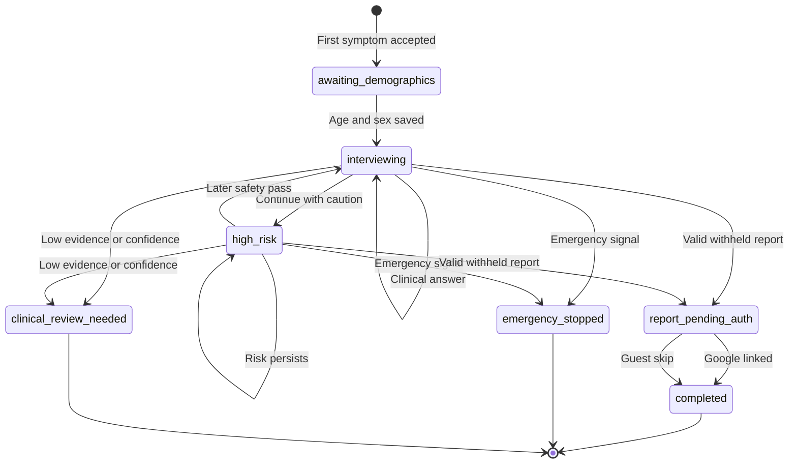

# LibertyMD Product Requirements Document

**Status:** Implementation baseline after 20-loop synthetic validation
**Product:** LibertyMD anonymous-first AI care chat
**Version:** 1.0 validation baseline
**Last updated:** July 18, 2026
**Owners:** Product, Clinical Safety, Engineering, Privacy/Compliance

## 1. Executive Summary

LibertyMD helps an adult describe symptoms, answer focused follow-up questions, pass an emergency safety screen, and receive a structured, doctor-ready health report. A visitor can begin without creating an account. LibertyMD creates a stable anonymous identity behind the scenes, asks for age and sex at birth after acknowledging the first symptom, and offers Google sign-in only when a report is ready.

The product is not a replacement for emergency services, an examination, or a licensed clinician. Its role is to collect clinically useful context, recognize when chat must stop for urgent care, organize a differential for non-emergency cases, and make the next clinical interaction more efficient.

The implementation uses a React frontend, Supabase Auth/Postgres/Edge Functions, and three stateless n8n inference workflows. Supabase is the only clinical system of record. n8n returns structured inference results and is configured not to retain successful, failed, or manual execution payloads.

## 2. Problem

People seeking health guidance often face four problems:

1. They do not know whether a symptom is urgent.
2. They struggle to describe symptoms in a clinically useful way.
3. They abandon care when registration is required before receiving value.
4. They repeat the same history when moving from self-guidance to a doctor.

Clinicians and care teams face the inverse problem: unstructured symptom narratives omit timing, severity, warning signs, relevant history, medicines, and allergies. This increases intake time and makes risk assessment harder.

## 3. Product Promise

**User-facing promise:** Clinically verified guidance for your symptoms.

**Supporting promise:** Free. Anonymous. Built by doctors.

The phrase "clinically verified" must be backed by documented clinical governance, approved medical content, and recurring review before public launch. Until that evidence exists, launch copy should use a less absolute formulation such as "clinically informed guidance."

## 4. Goals

- Let a new visitor start a consultation without a registration wall.
- Acknowledge the first symptom before requesting demographics.
- Collect explicit clinical slots through one focused question at a time.
- Screen every message for emergency and high-risk signals.
- Never release an empty, low-evidence, or low-confidence diagnosis report.
- Let an anonymous visitor link Google to the same identity and keep history.
- Let a guest skip sign-in and view only the current report for a limited period.
- Give returning users access to saved consultations and profile details.
- Produce a structured report that can reduce repetition with a clinician.
- Keep clinical writes, policy decisions, and access control in the backend.

## 5. Non-Goals For This Release

- A definitive diagnosis or guarantee of medical accuracy.
- Replacement for emergency services or in-person examination.
- Prescription issuance, doctor notes, billing, or insurance adjudication.
- Pediatric consultations; the current demographic control accepts adults 18-120.
- A clinician portal, EHR integration, or automated referral placement.
- Automated treatment execution without a clinician or approved protocol.

## 6. Personas

### 6.1 Anonymous Symptom Seeker

An adult who wants immediate guidance without sharing an email first. They need a fast start, plain language, clear privacy expectations, and a useful result before being asked to register.

### 6.2 Returning Patient

A person who previously linked Google and expects a personal greeting, saved reports, and less repeated data entry. They need secure access to history and transparent profile controls.

### 6.3 Safety-Critical Patient

A person describing chest pain, severe breathing difficulty, anaphylaxis, a thunderclap headache, or another emergency signal. They need chat to stop quickly and unambiguously with an emergency call to action.

### 6.4 Uncertain Or Low-Literacy User

A person who gives ambiguous, contradictory, or non-medical answers. They need simple redirection and must not receive a fabricated high-confidence report when the evidence is inadequate.

### 6.5 Clinician Or Telehealth Doctor

A clinician receiving the patient's structured report. They need chief complaint, timeline, severity, associated symptoms, warning-sign negatives, relevant history, medicines, allergies, differential reasoning, uncertainty, and recommended next step.

### 6.6 Clinical Operations And Compliance

The team responsible for safety review, prompt/version governance, incident investigation, retention, and access policy. They need auditable state transitions and separately persisted safety events without exposing raw records broadly.

## 7. Jobs To Be Done

- When I feel unwell, help me describe what is happening and decide what to do next.
- When my symptoms may be dangerous, tell me to seek emergency help immediately.
- When I do not know the right medical words, ask focused questions in plain language.
- When I reach a useful result, let me save it without making me restart.
- When I return, show my prior consultations under the same account.
- When I see a doctor, give me a concise record so I do not repeat the entire intake.

## 8. Experience Principles

- **Value before identity:** no login wall before the clinical interview.
- **One cognitive task at a time:** one question with at most four useful options.
- **Safety before completion:** emergency screening precedes ordinary inference.
- **Evidence over turn count:** 15 turns can end collection, but cannot force a report.
- **Uncertainty is a product state:** insufficient information results in review guidance, not invented certainty.
- **Progress without pressure:** indicate movement through intake without implying a diagnosis is guaranteed.
- **Plain-language transparency:** explain why age, sex at birth, sign-in, and escalation are requested.

## 9. End-To-End User Flow

### 9.1 New Anonymous Consultation

1. The user enters a symptom in the hero composer and selects **Start chat**.
2. Supabase creates or resumes an anonymous Auth user. This stable user ID owns all consultation rows.
3. LibertyMD stores the first symptom and runs the safety screen.
4. If no emergency is detected, the assistant acknowledges the symptom and asks for age and sex at birth using the embedded control.
5. Age and sex at birth are upserted into the account profile and self-patient record, and copied into the consultation's point-in-time patient snapshot.
6. The interview asks one focused follow-up question and presents up to four answer options while still accepting free text.
7. Every response passes through guardrail, relevance classification, explicit slot extraction, and evidence scoring.
8. Diagnosis runs when the interview is ready and periodically after enough turns, but a report is accepted only if all deterministic quality gates pass.

### 9.2 Report Gate

1. A valid report is stored as `withheld`; report content is not returned to the anonymous client.
2. LibertyMD shows a Google sign-in option and a skip option.
3. Google linking normally upgrades the same anonymous identity. Before redirecting, LibertyMD creates a ten-minute transfer secret and stores only its hash.
4. After same-ID OAuth, LibertyMD synchronizes the Google name, email, avatar, and provider and releases the report as `saved`.
5. If Google already belongs to another LibertyMD identity, the user signs into that account and a service-role-only transaction moves LibertyMD records into it without deleting the shared-project Auth user.
6. Skip releases only the current report as `guest_released` with a seven-day retention deadline.

### 9.3 Returning User

1. A linked user resumes through Supabase Auth.
2. The assistant can greet the user by first name.
3. The menu exposes profile and consultation history.
4. Selecting a consultation loads its transcript and an authorized saved or guest-released report.

### 9.4 Emergency Flow

1. Deterministic emergency patterns run before n8n.
2. The n8n guardrail independently returns `pass`, `high_risk_continue`, or `force_end`.
3. `force_end` stores a safety event, changes consultation status to `emergency_stopped`, and disables ordinary questioning.
4. The response clearly instructs the user to call emergency services or seek emergency care; the product must not bury this message under normal chat UI.

### 9.5 High-Risk But Continue

1. The guardrail persists `high_risk_continue` as its own safety event.
2. The consultation moves to `high_risk` and displays the risk-aware message.
3. Subsequent messages continue to be screened and may pass, remain high risk, or force an emergency stop.

### 9.6 Insufficient Or Non-Medical Information

1. `off_topic` answers cannot update clinical slots.
2. LibertyMD redirects the user to the current health question.
3. Three consecutive or five total non-clinical responses end in `clinical_review_needed`.
4. At 15 patient messages, low evidence or low confidence also ends in `clinical_review_needed`.
5. The user receives a safe next step and no differential report is released.

## 10. Consultation State Machine

## 11. Functional Requirements

### 11.1 Frontend

- The hero composer is visible at supported desktop heights and remains usable on narrow mobile screens.
- After the hero composer leaves the viewport, a glass-style fixed composer appears at the bottom without duplicating the active chat composer.
- Placeholder text clears on focus, remains left aligned, and has no default scrollbar.
- The first assistant response combines symptom acknowledgement with the age/sex control.
- The age control accepts integers from 18 through 120.
- Sex-at-birth choices support female, male, intersex, and prefer not to say in backend contracts; the UI must expose all approved options or document an intentional subset.
- Question options are keyboard accessible and free text remains available.
- Loading, retryable error, offline, emergency, report gate, report ready, review needed, empty history, and OAuth-return states are distinct.
- The menu provides profile and history only when the user has an active identity.
- The report gate offers Google and skip without implying that Google is required for medical safety.
- The report screen clearly separates likely possibilities, supporting evidence, uncertainty, warning signs, self-care, and recommended care setting.
- Medical disclaimers remain visible without competing with emergency instructions.

### 11.2 Backend Edge Function

- Authenticate every request and derive ownership from the bearer token, never from a client-supplied user ID.
- Support `bootstrap`, `start_consultation`, `save_demographics`, `send_message`, `release_report`, `sync_identity`, `get_history`, and `get_consultation`.
- Remain the only clinical writer to Postgres.
- Persist the user message before inference and record each safety decision separately.
- Require a client message UUID, atomically lease the consultation, reject concurrent turns, and replay completed retries without duplicating patient messages.
- Recover an interrupted request when its patient message was persisted but no assistant response was produced.
- Send explicit `filled_slots`, `missing_slots`, `target_slot`, patient data, turn count, and bounded transcript to n8n.
- Reject slot updates for off-topic input.
- Calculate deterministic evidence score and terminal outcome independently of model prose.
- Store a valid report as withheld before returning the report gate.
- Never return withheld report data through the client API or RLS.
- Apply bounded timeouts and return a safe retry state if an inference workflow fails.
- Keep prompt/workflow/model versions with the consultation or report for auditability.

### 11.3 n8n Guardrail Workflow

- Accept a minimal structured payload and return JSON only.
- Return status, risk level, crisis type, force-end flag, care setting, patient-facing message, and red flags.
- Distinguish `high_risk_continue` from `force_end`.
- Avoid diagnosis or routine questioning in an emergency response.
- Use Gemini 3.1 Flash-Lite for the current cost-controlled deployment.

### 11.4 n8n Interview Workflow

- Ask one focused question per turn.
- Return up to four concise options plus free-text support.
- Return `input_relevance`, relevance reason, `slot_updates`, `target_slot`, remaining slots, and `ready_for_report`.
- Treat uncertain or contradictory values as missing rather than converting them into affirmative clinical facts.
- Return no slot updates and `ready_for_report=false` for off-topic input.
- Personalize with a linked user's first name only when supplied by the backend.

### 11.5 n8n Diagnosis Workflow

- Produce a structured report with a non-empty ranked differential.
- Include supporting evidence, evidence against, red flags, recommended care setting, next steps, and uncertainty.
- Return confidence as a 0-100 numeric score.
- Validate that confidence is at least 60 and evidence score is at least 65 before `valid_report=true`.
- Do not treat "unknown", "uncertain", contradictory, or unreliable values as evidence.
- Return a validation reason when a report is withheld.

## 12. Clinical Slot Model

The interview maintains explicit structured state rather than re-inferring all context from transcript text.

| Slot | Purpose | Evidence weight |
| --- | --- | ---: |
| `chief_complaint` | Primary symptom in the user's words | 25 |
| `onset` | When it started | 15 |
| `duration` | How long it has been present | 10 |
| `severity` | Patient-reported intensity | 15 |
| `associated_symptoms` | Other symptoms that shape the differential | 10 |
| `red_flag_negatives` | Explicitly denied warning signs | 15 |
| `relevant_history` | Conditions, medicines, or context affecting risk | 10 |

Additional collected slots include location, character, functional impact, medicines, allergies, and pregnancy status. A sufficient evidence score requires a chief complaint, a timeline, symptom detail, safety information, and at least 65 weighted points.

## 13. Report Decision Policy

| Condition | Outcome |
| --- | --- |
| Emergency detected | `emergency_stopped` |
| Three consecutive or five total non-clinical answers | `clinical_review_needed` |
| Turn 15 with insufficient evidence | `clinical_review_needed` |
| Turn 15 with sufficient evidence but low confidence | `clinical_review_needed` |
| Valid report, sufficient evidence, confidence 80+ | Complete as high confidence |
| Interview ready, sufficient evidence, confidence 60+ | Complete as workflow ready |
| Turn 15, sufficient evidence, confidence 65+ | Complete at turn limit |
| Otherwise | Continue focused questioning |

The policy controls report release. Model-generated confidence alone cannot bypass it.

## 14. Data Model

### `libertymd_profiles`

One row per Supabase Auth user with a unique `user_id`. Stores display name, email, avatar, age, sex at birth, provider, anonymous status, consent version, and timestamps. Profile creation uses upsert behavior.

### `libertymd_patients`

Separates the person receiving care from the account that owns access. Stores relationship, display label, age, sex at birth, gender identity, active state, and timestamps. The current release creates one self-patient per account and leaves room for dependents later.

### `libertymd_consultations`

Stores the patient reference and immutable intake snapshot plus state machine status, region, chief complaint, patient turn count, explicit filled/missing slots, target slot, intermediate differentials, safety state, report gate, workflow versions, non-clinical counters, evidence score, resolution reason, activity, completion, and retention timestamps.

### `libertymd_messages`

Stores the ordered transcript with role, message type, content, options, target slot, slot updates, workflow metadata, and timestamp.

### `libertymd_safety_events`

Stores every guardrail result separately, including `high_risk_continue`, risk, crisis type, care setting, force-end flag, red flags, source, and raw structured result.

### `libertymd_reports`

Stores one report per consultation with report JSON, confidence, the selected diagnostic-run reference, model metadata, access status, release time, retention deadline, and timestamps.

### `libertymd_diagnostic_runs`

Append-only record of every diagnosis attempt, including input snapshot, clinical summary and reasoning, differential, confidence, evidence, validation result, and model/workflow metadata. An invalid attempt remains auditable and cannot become a report merely because the turn limit was reached.

### Identity, consent, and product ledgers

`libertymd_identity_events` records linking and merge lifecycle events. `libertymd_account_merges` stores hashed, expiring transfer tokens. `libertymd_consent_events` is append-only and versioned. `libertymd_product_events` accepts only allow-listed non-clinical events and must never contain symptoms, transcripts, diagnoses, reports, names, or email addresses.

All updateable core tables use an `updated_at` trigger. Query-critical fields are typed; evolving clinical/report structures use JSONB.

## 15. Authentication And Authorization

- New visitors use Supabase anonymous Auth, not a client-generated pseudo-ID.
- Google uses manual identity linking to keep the same `auth.users.id` whenever the Google identity is new.
- Existing-Google-account recovery uses an expiring one-time token and a service-role-only transaction to transfer LibertyMD ownership to the existing ID.
- The backend derives `user_id` from the authenticated request.
- RLS permits a user to read their own profile, consultations, and messages.
- Reports are readable only when `access_status` is `saved` or `guest_released`.
- Service-role access is limited to the Edge Function and operational jobs.
- The OAuth callback must validate the session and invoke `sync_identity` before releasing saved reports.

## 16. Privacy, Retention, And Security

- n8n performs no Supabase writes.
- All three workflows disable success, error, manual, and progress execution payload storage.
- Host-level n8n pruning must be configured and verified independently.
- Guest-released reports expire after seven days; inactive anonymous profiles without consultations can be cleaned after 30 days.
- A scheduled job must run `cleanup_expired_libertymd_data()` daily.
- Webhook authentication uses a server-side secret; it is never exposed to the browser.
- Add CAPTCHA or Turnstile, IP/user rate limits, body-size limits, and abuse monitoring before public anonymous launch.
- Define redaction and access procedures for support, incident response, and analytics.
- Do not send raw patient text to general product analytics.

## 17. Scalability And Reliability

- Keep the Edge Function stateless; Postgres stores authoritative consultation state.
- Use indexed owner/activity, status, message sequence, safety, retention, and resolution queries.
- Every message submission uses a stable idempotency key for safe retries across unreliable networks.
- Every client submission carries the last-read consultation version; a database lease and optimistic version check prevent simultaneous messages from overwriting slots.
- Bound transcript context and rely on explicit slots plus summaries as conversations grow.
- Add workflow timeout, circuit breaker, and safe fallback behavior for n8n/model outages.
- Queue non-interactive work such as report enrichment, notifications, cleanup, and analytics.
- Measure p50/p95/p99 latency independently for guardrail, interview, and diagnosis.
- Version prompts, schemas, models, evidence policy, and clinical content so a report can be reproduced.

## 18. Analytics And Success Metrics

No raw clinical text should enter the product analytics stream.

### Funnel

- Hero start rate.
- Demographics completion rate.
- First follow-up response rate.
- Consultation completion rate.
- Report-gate Google link rate and skip rate.
- Returning-user history open rate.

### Quality And Safety

- Emergency-stop rate and clinician-reviewed false positive/negative rate.
- High-risk-continue rate and later escalation rate.
- Median patient turns to valid report.
- `clinical_review_needed` rate by reason.
- Off-topic redirection recovery rate.
- Reports withheld by evidence, confidence, empty differential, or workflow failure.
- Clinical review agreement with differential and care setting.

### Reliability And Cost

- Workflow success and timeout rate.
- p50/p95 latency per workflow.
- Tokens and model cost per completed consultation.
- Duplicate message/submission rate.
- Anonymous-to-linked identity failure rate.

## 19. Accessibility And Responsive Requirements

- Meet WCAG 2.2 AA contrast, focus, keyboard, label, and reduced-motion expectations.
- Do not rely on color alone for risk or selected states.
- Keep emergency instructions readable at 200 percent zoom.
- Support narrow mobile layouts without hiding the primary composer, report gate, or safety instruction.
- Announce assistant messages, loading, validation errors, and terminal state changes to assistive technology.
- Respect `prefers-reduced-motion` for decorative and progress animation.

## 20. Acceptance Criteria

- A clean new visitor can receive an anonymous identity and start without email.
- The first safe response acknowledges the symptom and requests age and sex.
- Demographics persist on the unique profile row.
- Every patient message produces a persisted safety event.
- Emergency cases stop before diagnosis and display explicit emergency action.
- High-risk-continue is persisted and surfaced separately.
- Off-topic answers do not populate slots.
- Low-evidence or low-confidence turn-15 cases do not receive a report.
- A valid report is stored withheld and cannot be read before release.
- Google linking preserves the same user ID when possible; an existing-account conflict securely transfers LibertyMD history to the already-linked ID.
- Skip releases only the current report with limited retention.
- Returning linked users can load authorized history.
- All workflows return schema-valid JSON and retain no execution payloads.
- Desktop and mobile flows pass keyboard, responsive, and state-transition tests.

## 21. Validation Summary

Twenty ordered loops exercised the same four fixtures in every loop: Low Fever, Heart Attack, no high-confidence diagnosis after 15 patient messages, and repeated non-medical answers. Loops 1-10 ran deterministic Codex simulations. Loops 11-18 ran live n8n requests with stable Gemini 3.1 Flash-Lite, Google's current most cost-efficient general-purpose Gemini model for high-volume agentic work. Loops 19-20 explicitly confirmed that final model and configuration.

The first Loop 1 attempt stopped on a sports-query relevance defect. The policy was corrected, Loop 1 was rerun successfully, and only then did the sequence advance. The final evidence contains 80 passing required case executions across 20 passing loops, including 10 live executions of each fixture.

The loops validate orchestration and policy contracts, not clinical efficacy. See [20-LOOP-VALIDATION-LEDGER.md](./20-LOOP-VALIDATION-LEDGER.md) for findings, fixes, observed confidence, and residual risk.

## 22. Rollout Plan

### Gate 0: Configuration

- Anonymous sign-ins, Google OAuth, manual identity linking, and LibertyMD callback URLs are enabled.
- Add CAPTCHA, monitored rate limits, and abuse alerts.
- Verify n8n webhook secret, log redaction, and host-level execution pruning.

### Gate 1: Internal Alpha

- Run automated policy, schema, browser, and RLS tests in CI.
- Conduct clinician-authored scenario review across common and high-risk complaints.
- Verify retention cleanup and access audit procedures.

### Gate 2: Limited Beta

- Release to a small adult cohort with incident monitoring.
- Manually review safety escalations and a sample of withheld/completed reports.
- Tune prompts or thresholds only through versioned, clinically reviewed changes.

### Gate 3: Public Launch

- Require clinical governance sign-off, privacy/legal review, accessibility review, load testing, and on-call ownership.
- Publish limitations, emergency guidance, privacy terms, and report-retention behavior.

## 23. Remaining Launch Gates

The anonymous-first engineering flow is enabled and live-smoke verified. Public clinical launch still requires a designated-account Google callback test for both new and existing Google identities, clinician-approved scenarios and thresholds, privacy/legal approval, CAPTCHA and abuse controls, scheduled retention cleanup, and n8n host-level retention verification.

## 24. Open Decisions

- Final public wording and evidence for the "clinically verified" claim.
- Supported countries, emergency numbers, legal entity, and medical-device classification.
- Clinical ownership of prompt, evidence-weight, and care-setting changes.
- Whether guest report access should require a one-time recovery code.
- Doctor handoff, report export, and EHR interoperability scope.
- Pediatric, pregnancy, mental-health crisis, medication, and image-upload policy.
- Maximum acceptable latency and per-consultation inference budget.

## 25. Implementation References

- [Care architecture](./CARE-ARCHITECTURE.md)
- [20-loop validation ledger](./20-LOOP-VALIDATION-LEDGER.md)
- `supabase/functions/libertymd-care-proxy/`
- `supabase/migrations/20260718080000_libertymd_care_schema.sql`
- `supabase/migrations/20260718090000_libertymd_clinical_quality_gates.sql`
- `supabase/migrations/20260719100000_libertymd_identity_and_diagnostic_tracking.sql`
- `components/LibertyMD/LibertyMDCareControls.tsx`
- `scripts/libertymd-flow-simulation.ts`
- `scripts/libertymd-live-validation.ts`
- `scripts/libertymd-validation-cases.ts`
- [Requirements compliance audit](./REQUIREMENTS-COMPLIANCE-AUDIT.md)
- [Implementation and assurance status](./IMPLEMENTATION-ASSURANCE-STATUS.md)
- [n8n host retention runbook](./N8N-HOST-RETENTION-RUNBOOK.md)
- `supabase/migrations/20260718100000_libertymd_request_reliability.sql`
- `supabase/migrations/20260718110000_libertymd_partial_retry_recovery.sql`
- `scripts/libertymd-live-backend-smoke.mjs`
- `schemas/libertymd/`
- `governance/libertymd/`
