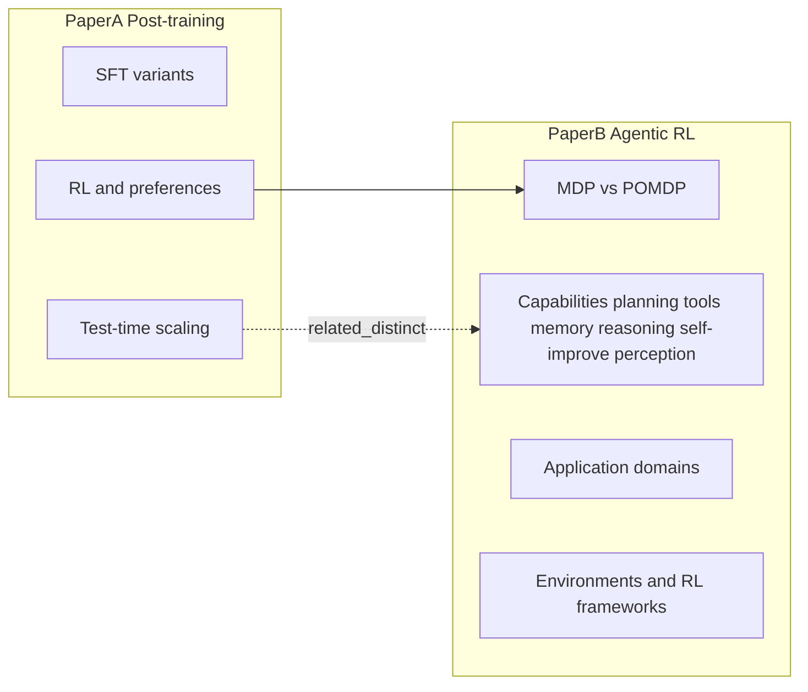
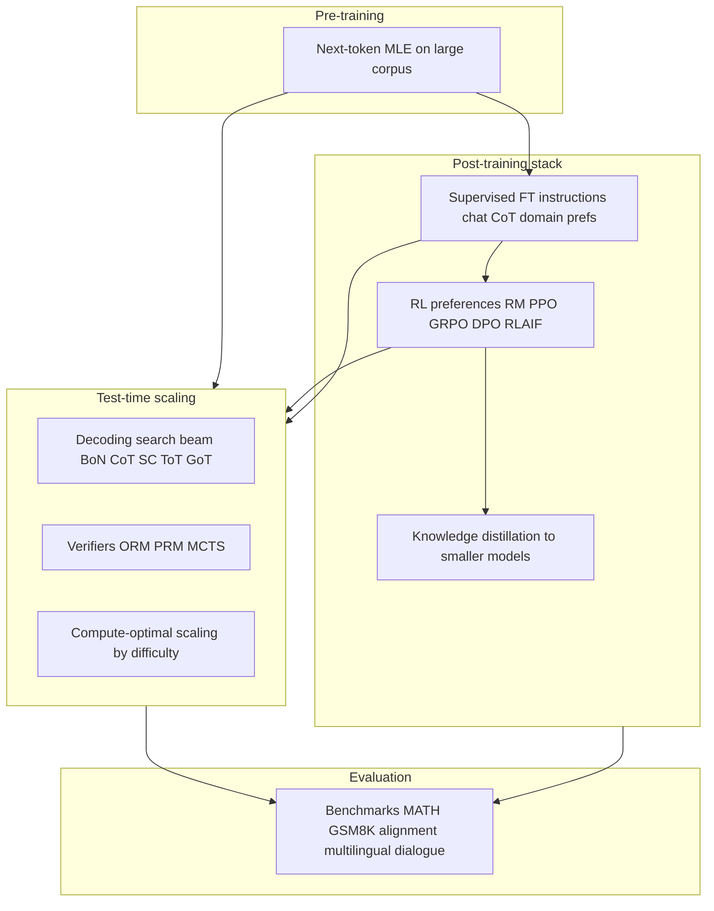
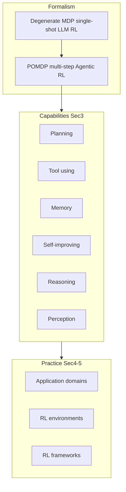

# Two-survey digest: post-training and agentic RL

This note summarizes two distinct surveys. Full PDFs: *Post Training Overview* (Kumar et al.) and *The Landscape of Agentic Reinforcement Learning for LLMs* (Zhang et al.).

| Paper | Title (short) | arXiv | Repo |
|--------|----------------|-------|------|
| **A** | *LLM Post-Training: A Deep Dive into Reasoning LLMs* | [2502.21321](https://arxiv.org/abs/2502.21321) | [Awesome-LLM-Post-training](https://github.com/mbzuai-oryx/Awesome-LLM-Post-training) |
| **B** | *The Landscape of Agentic Reinforcement Learning for LLMs: A Survey* | [2509.02547](https://arxiv.org/abs/2509.02547) | [Awesome-AgenticLLM-RL-Papers](https://github.com/xhyumiracle/Awesome-AgenticLLM-RL-Papers) |

---

## How the two surveys relate

- **Paper A** maps **post-training** broadly: **SFT** (many flavors), **RL / alignment** (RLHF, DPO, GRPO, …), and **test-time scaling** (decoding, search, verifiers), plus benchmarks and challenges (forgetting, reward hacking, inference cost).
- **Paper B** formalizes a shift from **classic LLM RL**—often a **degenerate single-step MDP** (one prompt → one completion → scalar reward)—to **Agentic RL**, where the model is an **agent** in **temporally extended, partially observable** settings (**POMDPs**): multi-turn actions, tools, environment feedback, long horizons.
- **Overlap:** RL for reasoning, rewards, multi-step behavior, evaluation. **Difference:** A stresses **TTS and SFT taxonomy**; B stresses **agent capabilities** (planning, tools, memory, reasoning, self-improvement, perception), **application domains**, and **RL environments / frameworks**.

---

## Paper A — what it is trying to convey

1. **Pre-training is not enough:** Web-scale next-token prediction leaves hallucinations, weak alignment, and “reasoning” as pattern completion, not guaranteed logic.
2. **Post-training is the main lever:** Stack **SFT**, **RL** / preferences, and **test-time scaling** to specialize, align, and improve accuracy without always growing parameters.
3. **Three pillars (taxonomy):**
   - **Fine-tuning:** Instruction, dialogue, CoT, domain-specific, distillation, preference SFT, PEFT (LoRA, adapters, …).
   - **RL / alignment:** RLHF, RLAIF, DPO-class, PPO, GRPO, reward models, cold-start SFT, distillation (e.g. DeepSeek-R1-style pipelines discussed in the survey).
   - **Test-time scaling:** Beam / best-of-N, CoT / self-consistency, ToT / GoT, ORM / PRM, MCTS, self-refinement, compute-optimal routing by difficulty.
4. **Challenges:** Catastrophic forgetting, reward hacking, inference cost vs quality, robust rewards and evals.

### Paper A — section spine (mermaid)

**Intuition:** Pre-training = fluency. SFT = format and tasks. RL = what gets rewarded. TTS = extra inference compute without weight updates. Distillation = teacher → student.

---

## Paper B — core thesis and outline

**Thesis:** *Agentic RL* reframes LLMs from **passive sequence generators** to **autonomous decision-making agents** in **complex, dynamic worlds**. RL is the mechanism that turns **static or heuristic** modules into **adaptive** agentic behavior. The survey synthesizes **500+** works and compiles environments, benchmarks, and frameworks.

**Conceptual contrast:**

| Idea | LLM RL (classical framing in B) | Agentic RL |
|------|----------------------------------|------------|
| Process model | Often **single-step** or degenerate **MDP** | **POMDP**: partial observability, multiple time steps |
| State | Prompt + fixed context | Environment state, tool outputs, memory, hidden world state |
| Actions | “Emit one completion” | Emit utterances, **tool calls**, navigation steps, memory updates, … |
| Horizon | One shot | Multi-turn, long-horizon |
| Reward | End of sequence (or RM on completion) | Task success, process, safety, cumulative over trajectory |

**Paper B — typical section spine (mirrors survey structure)**

- **§2 From LLM RL to Agentic RL:** MDP preliminaries; **environment state**, **action space**, **transition dynamics**, **reward**, **learning objective**, **learning algorithm**—specialized for LLM agents vs single-shot RLHF.
- **§3 RL for agentic capability:** **Planning**, **tool using**, **memory**, **self-improving**, **reasoning** (and **perception** in the taxonomy referenced in the abstract)—each as an RL-optimizable capability.
- **§4 Applications:** Domains such as search, GUI navigation, code generation, math reasoning, multi-agent systems (representative areas surveyed).
- **§5 Environments and frameworks:** Open-source **RL environments** and **RL frameworks** for training/evaluating agents.
- **§6–7 Challenges, future directions, conclusion:** Scalable, adaptive, reliable agents; trust and related issues (e.g. §6.1 trust in the survey’s outline).

### Paper B — capability spine (mermaid)

---

## Side-by-side comparison (A vs B)

| Topic | Paper A | Paper B |
|-------|---------|---------|
| **Primary lens** | Post-training stack: SFT + RL + TTS | Agentic RL: MDP/POMDP and **capabilities** |
| **TTS / inference search** | Central (beam, BoN, CoT-SC, MCTS, verifiers) | Less central; focus on **training** agents in envs |
| **SFT taxonomy** | Deep (instruction, chat, CoT, domain, PEFT, …) | Present where it supports agent skills; not the main axis |
| **RL algorithms** | RLHF, DPO, PPO, GRPO, … | Same family, placed inside **multi-step** / **tool** / **memory** loops |
| **Formal RL model** | Implicit (policy, RM, KL) | Explicit **MDP vs POMDP** story |
| **Environments** | Benchmarks for reasoning / alignment | **RL environments** + frameworks as first-class |
| **Best for understanding** | “How do we train and decode **reasoning** models end-to-end?” | “How do we train **agents** that act over time with tools and feedback?” |

---

## Combined glossary (A + B)

| Term | Meaning |
|------|---------|
| **Post-training** | After pre-training: alignment, SFT, RL, distillation (Paper A). |
| **LLM RL** | RL on language policies—often one completion scored (Paper B: can be **degenerate single-step MDP**). |
| **Agentic RL** | LLM as **agent**: sequential decisions in **POMDP**-style settings (Paper B). |
| **MDP** | Markov decision process: state, action, transition, reward; Markov property. |
| **POMDP** | Partially observable MDP: agent sees **observations**, not full state—fits tool loops and hidden env state (Paper B). |
| **Degenerate MDP** | Survey B’s term for overly simplified single-shot LLM RL (one step to terminal reward). |
| **SFT / Instruction tuning** | (A) Instruction–response supervision. |
| **RLHF / RLAIF / DPO** | (A) Preference-based alignment; algorithms vary. |
| **GRPO** | (A) Group-relative policy optimization for reasoning RL. |
| **ORM / PRM** | (A) Outcome vs process reward models. |
| **TTS** | (A) Test-time scaling—extra inference compute, no weight change. |
| **Planning / tool use / memory** | (B) Core **capabilities** trained or improved with RL in agent settings. |
| **Self-improving** | (B) Reflection, self-critique, iterative improvement as RL-optimizable. |
| **Reward hacking** | (A) Exploiting proxy rewards or verifiers. |

---

## Novice → expert — Paper B (extra ladders)

**1. Why POMDP for “agents”?**

- *Novice:* The model doesn’t see everything at once (web result, file contents, game screen)—like playing with fog of war.
- *Intermediate:* Observations \(o_t\), actions \(a_t\) (text + tool calls), belief over hidden state; reward may be **sparse** and **delayed** until task ends.
- *Expert:* Design choices: observation design, action API, credit assignment across tool steps, non-stationarity when environment or user changes.

**2. Tool-use RL vs supervised tool demos**

- *Novice:* SFT teaches “call this API in this example”; RL teaches “call it when it **helps** the reward.”
- *Intermediate:* RL explores **wrong** tool chains; needs verifiers or env feedback; exploration cost.
- *Expert:* Combine offline demos (BC / SFT) with on-policy RL, curriculum over environments, reward shaping vs sparse success.

**3. Where Paper A’s TTS meets Paper B’s agents**

- *Novice:* Both improve **multi-step** outcomes; TTS usually **does not** change weights; agent RL **does**.
- *Intermediate:* You can use **search / BoN / verifiers** (A) **inside** an agent’s loop at inference (tool-free “thinking”) vs **learning** a policy that chooses tools (B).
- *Expert:* Budget allocation: TTS scales **inference FLOPs**; agentic RL scales **training** and **interaction steps**; hybrid systems use both.

---

## Practical mental models

**Paper A:** Train-time improves the **policy**; test-time **TTS** improves realized outputs via search and verification; recipes often chain SFT → RL → rejection sampling → SFT → optional alignment RL → distillation.

**Paper B:** Treat the LLM as a **policy** in a **POMDP**; optimize **capabilities** that interact with **environments**; use published **envs and frameworks** to compare methods fairly.

---

## Sources

- Kumar et al., *LLM Post-Training: A Deep Dive into Reasoning Large Language Models*, arXiv:2502.21321.
- Zhang et al., *The Landscape of Agentic Reinforcement Learning for LLMs: A Survey*, arXiv:2509.02547.
